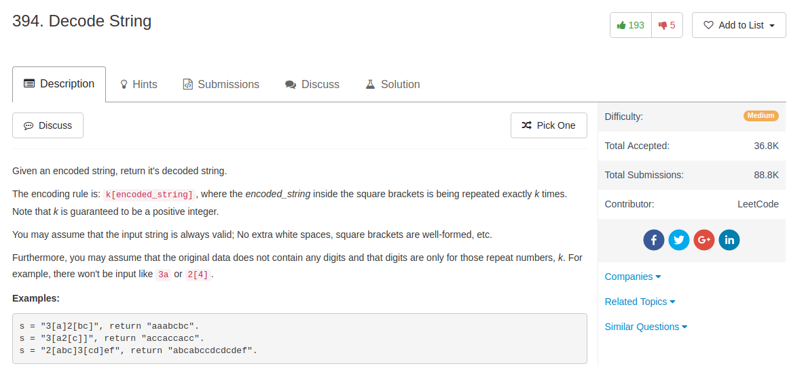

## Algorithm

- 这道题目我写的是递归，就是每次看到一个`k[]`，就先递归扩展`[]`里面的内容，然后回溯上来的时候乘以`k`次。
- 其实一开始我想的办法就是逐层分解，每次分解最外面的一层，比如`3[a2[c]]`分解成`a2[c]a2[c]a2[c]`，然后再把所有的`a2[c]`分解。这样唯一的问题是，如果`k`很大的话，这样就非常没有效率，因为递归一次可以展开的内容，这种情况下要重复做`k`次。
- 当然，[这里](https://discuss.leetcode.com/topic/57145/3-lines-python-2-lines-ruby-regular-expression/2)用regex来做也是非常简洁的，但是思路跟第二个差不多，所以还是有效率上的担忧。

## Comment

- 字符串操作啊

## Code


```python
class Solution(object):
    def decodeString(self, s):
        """
        :type s: str
        :rtype: str
        """
        ind, n = 0, len(s)
        ans = ''
        while ind < n:
            times = 0
            while s[ind] in '0123456789':
                times = times * 10 + int(s[ind])
                ind = ind + 1
            if s[ind] == '[':
                count = 1
                start = ind + 1
                while count > 0:
                    ind = ind + 1
                    if s[ind] == '[':
                        count += 1
                    if s[ind] == ']':
                        count -= 1
                finish = ind
                sub = self.decodeString(s[start:finish])
                ans = ans + sub * times
            else:
                ans = ans + s[ind]
            ind += 1
        return ans
```
