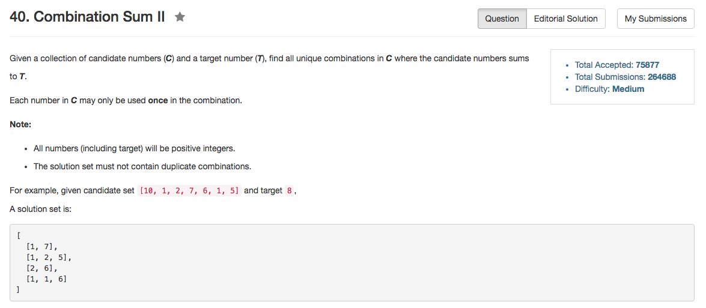

## Algorithm 

- 这个题目就是回溯，是39题的提高版。
- 主要的难点在于判重，我一开始纠结了好久。
- 基本的思路如下：
    1. 在加和的过程中考虑当前值。
    2. 如果在加和的过程中不考虑当前值，那么之后所有和当前值相同的值全都不考虑到加和过程中。
    3. 排序保证加和的序列非降。

## Comment

- 感觉程序写的其实不是很好看，但是已经是精简过了。
- 这个题目本质上就是背包问题，经典回溯。

## Code

```C++
class Solution {
public:
    vector<vector<int>> combinationSum2(vector<int>& candidates, int target) {
        sort(candidates.begin(), candidates.end());
        search(candidates, 0, target);
        return results;
    }
private:
    vector<vector<int>> results;
    vector<int> tmpResults;
    void search(vector<int>& candidates, int position, int target){
        if (!target){
            results.push_back(tmpResults);
            return;
        }
        if (position >= candidates.size()) return; 
        if (target >= candidates[position]){
           //put current
           tmpResults.push_back(candidates[position]);
           search(candidates, position + 1, target - candidates[position]);
           tmpResults.pop_back();
           //dont' put current or any value the same as current
           int val = candidates[position];
           while (candidates[position] == val) position++;
           search(candidates, position, target);    
        }
    }
};
```
