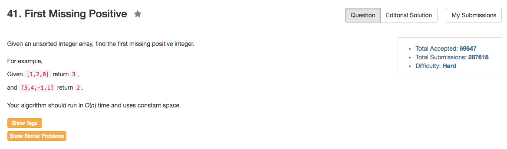

## Algorithm 

- 这道题目的哲学就在于：把东西摆在应该有的位置
- 简单地说，如果数字是5，那么就要把这个数字放到`nums[4]`这个位置上。
    1. 如果`nums[4] == 5`，那就不要动了。
    2. 如果`nums[4] != 5`，那么就把`x = nums[4]`这个值跟`nums[x - 1]`交换，这样至少可以保证`x`放到了正确的位置上。不断进行这个交换，直到`nums[4] == 5`或者`nums[4]`的值超出了1到n的范围。
    3. 最后从头往后找一遍，如果`nums[i] != i+1`，那么`i+1`就是第一个没有的正数。

## Comment

- 没有考虑到有重复元素的情况，结果边界条件导致了死循环。这一点没有考虑到位。

## Code


```C++
class Solution {
public:
    int firstMissingPositive(vector<int>& nums) {
        int n = nums.size();
        for (int i = 0; i < n; i++){
            if (nums[i] != i + 1) {
                while (nums[i] > 0 && nums[i] < n && nums[i] != nums[nums[i] - 1]) swap(nums[i], nums[nums[i] - 1]);
            }
        }
        for (int i = 0; i < n; i++){
            if (nums[i] != i + 1) return i + 1;
        }
        return n + 1;
    }
};
```
