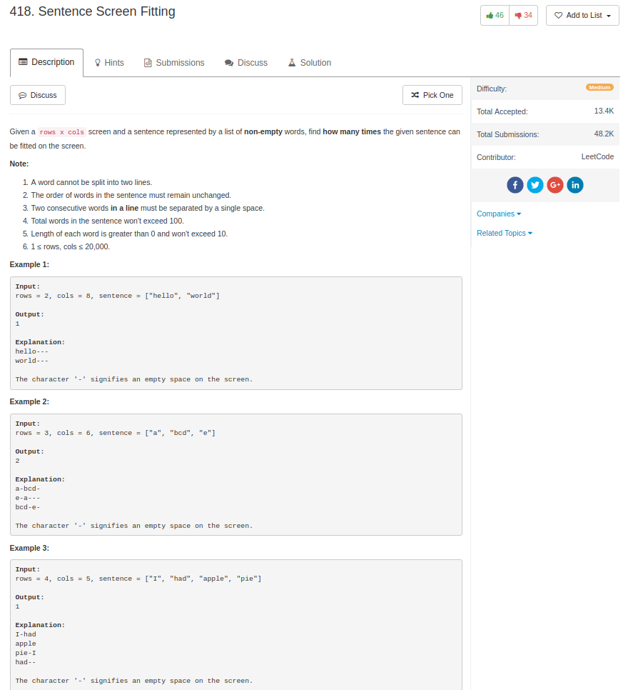

## Algorithm

- 这个题目，我是直接暴力写，然后慢慢优化的
  - 优化1：如果从一开始暴力枚举到某一行`i`结束，这个时候刚好写完整句话，下一行要从头开始写，那么剩下有多少倍从当前的行数，就可以复制多少次当前的pattern
    - 如果我同时记录`F[i]`等于从1到`i`行能写多少个句子，那么`F[n] = (n/i)*F[i] + F[n % i]`
    - 这样就解决了很多rows的问题
  - 优化2：如果当前这一行特别长，我已经写完一句话了，但是还剩好多，那么我直接开剩下的空格能够写多少句话，`k / (len(sentence) + 1)`，其中这个`+1`是句子之间的空格，然后直接跳到最后继续写下一句话的开始。

## Comment

- 这题目还不是很好写啊，看起来很暴力，实际上很tricky

## Code

我的解

```python
class Solution(object):
    def wordsTyping(self, sentence, rows, cols):
        """
        :type sentence: List[str]
        :type rows: int
        :type cols: int
        :rtype: int
        """
        ind, total, row = 0, 0, 1
        length_list = [len(x) for x in sentence]
        total_len = len(' '.join(sentence)) + 1
        memory = {0:0}
        while row <= rows:
            k = cols
            while k > 0:
                k = k - length_list[ind] - (k <> cols)
                if k >= 0:
                    ind += 1
                    if ind >= len(sentence):
                        ind = 0
                        total += 1
                        if k > total_len:
                            total += int(k / total_len)
                            k = k % total_len
            memory[row] = total

            if ind == 0:
                total = int(rows / row) * total + memory[rows % row]
                break
            row += 1
        return total
```

别人的解，来自[这里](https://discuss.leetcode.com/topic/64964/python-108ms-solution)

```python
class Solution(object):
    def wordsTyping(self, sentence, rows, cols):
        word_nums = self.preprocess(sentence, cols)          
        word_count = 0                
        for _ in xrange(rows):
          #这个思路是不断地累加每一行能写多少个单词，其实这里还能继续memorize一下
            word_count += word_nums[word_count % len(sentence)]
        return word_count/len(sentence)

    # Preprocessing
    def preprocess(self, sentence, cols):
      #Word_nums是从当前word开始，一行能够写多少个单词
        word_nums = [0] * len(sentence)
        word_ptr, word_sum = 0, 0
        word_len = len(sentence[0])
        for i, word in enumerate(sentence):
            while(word_sum + word_len <= cols):
                word_sum += word_len
                word_ptr += 1
                word_len = len(sentence[word_ptr % len(sentence)]) + 1
            word_nums[i] = word_ptr - i
            word_sum -= (len(word) + 1)
        return word_nums
```
