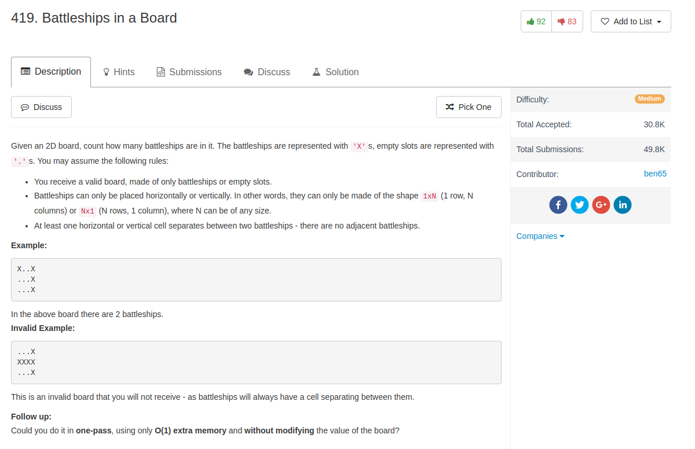

## Algorithm

- 最直接的办法是深搜咯，从一个没有访问过的点出发，然后扩展所有与之相邻的点，这样找到了一个battleship
- 稍微优化一下可以通过改变棋盘来做到这一点，如果`board[i] == 'X'`, 那么如果它相邻的地方有一个数值（代表battleship的编号），那这个格子就这同样是这个编号。最后统计有多少不同的编号就好。
- 然后题目要求**one-pass, O(1) extra memory, without modifying board**，想了一下，发现：
  - 我们从左往右，从上到下遍历整个棋盘
  - 只要某一个`board[i][j] == 'X'`，但是它的`board[i-1][j]`和`board[i][j-1]`都不是`'X'`，那这个就肯定是battleship的头，然后总量加1就好了。

## Comment

- 当然还是可以写得更好
- 基本的思路就是先reverse加上了符号以后再reverse回去。

## Code


```python
class Solution(object):
    def countBattleships(self, board):
        """
        :type board: List[List[str]]
        :rtype: int
        """
        total = 0
        row, col = len(board), len(board[0])
        for i in range(row):
            for j in range(col):
                if board[i][j] != 'X' or (i > 0 and board[i - 1][j] == 'X') or (j > 0 and board[i][j - 1] == 'X'):
                    continue
                else:
                    total = total + 1
        return total

```
