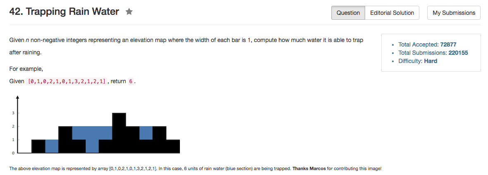

## Algorithm 

- 这个题目并不是那么难，在已经知道最优的是O(N)的时间复杂度的情况下，想出一个算法还是可能的。
- 我想的使用stack：我们实际上就是要找到当前点为右端点时，左端点可以到哪里，这段区间可以盛放多少水。
    - 这样我们就维护一个高度递减的stack：
        1. `if height[i] < height[stack.top()]`，那么以它为右端点是trap不到任何水的。入栈；
        2. `if height[i] > height[stack.top()]`，那么如果`stack.top()`右边有一个高度比`stack.top()`的高度高一些的`j`，那么这个`j <-> i`之间就可以接到一部分水，容量取决于`i - (j + 1)`的宽度，和`min(height[i], height[j])`的高度。
    - 我们对于每一个元素，入栈一次，出栈一次，时间复杂度是O(N)
- [这里](https://discuss.leetcode.com/topic/18731/7-lines-c-c/2)有更好、更简洁的解：
    - 类似11题一样，不断地从左右两端往中间加紧，并且不断地抛弃左右两端矮的值。
        1. 维护一个当前最优两边最低的高度`level`，作为一个坎。
        2. 每一次看左(`left`)右端点(`right`)哪一个更小：
            - 如果`left`更小，先看它是否大于`level`。如果是的，那么更新`level`；如果不是，说明在`left`更左边有一个比当前`left`更高的坎作为左边界，右边有一个比当前`left`更高的坎作为右边界，那么`level - left`这么多的水就会被收集起来
            - 如果`right`更小，进行类似的处理。
    - 代码看下面，这个代码写得非常好，这个思路也非常值得学习。
    
## Comment

- 在`height[i] >= height[leftEnd.top()]`成立的时候，要计算这种情况下可以盛多少水这个步骤，需要好好想想。写了几次都写错了。

## Code


```C++
class Solution {
public:
    int trap(vector<int>& height) {
        stack<int> leftEnd;
        int water = 0, n = height.size();
        for (int i = 0; i < n; i++){
            while (leftEnd.size() && height[i] >= height[leftEnd.top()]){
                int stage = leftEnd.top();
                leftEnd.pop();
                if (leftEnd.size()) {
                    water += (min(height[i], height[leftEnd.top()]) - height[stage]) * (i - (leftEnd.top() + 1));
                }
            }
            leftEnd.push(i);
        }
        return water;
    }
};
```

上面提到的第二种解法，非常简洁，来自[这里](https://discuss.leetcode.com/topic/18731/7-lines-c-c/2)

```C++
int trap(vector<int>& height) {
    int l = 0, r = height.size()-1, level = 0, water = 0;
    while (l < r) {
        int lower = height[height[l] < height[r] ? l++ : r--];
        level = max(level, lower);
        water += level - lower;
    }
    return water;
}
```