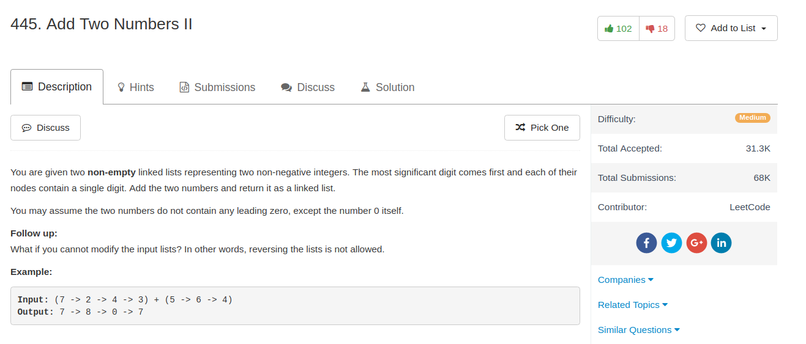

## Algorithm

- 这道题目主要是写Linked List，我写的Python版本就是把两个Linked List先Reverse，然后做完加法以后再Reverse回去。其实感觉写的蛮丑的。
- 另外如果不能用reverse，那就肯定是写stack了

## Comment

- 主要还是漂亮的方法写Linked List吧

## Code

这是最后写的没有用reverse的代码，本质上就是用了两个stacks，不过我用了`itertools.izip_longest`来模拟stack的操作

```python
import itertools

class Solution(object):


    def addTwoNumbers(self, l1, l2):
        """
        :type l1: ListNode
        :type l2: ListNode
        :rtype: ListNode
        """
        s1, s2 = [], []
        while l1 is not None:
            s1.append(l1)
            l1 = l1.next
        while l2 is not None:
            s2.append(l2)
            l2 = l2.next
        carry = 0
        ans = None
        for a, b in itertools.izip_longest(s1[::-1], s2[::-1]):
            val1 = a.val if a is not None else 0
            val2 = b.val if b is not None else 0
            value = val1 + val2 + carry
            tmp = ListNode(value % 10)
            tmp.next, ans = ans, tmp
            carry = 1 if value >= 10 else 0
        if carry > 0:
            tmp = ListNode(1)
            tmp.next, ans = ans, tmp    
        return ans
```


这个是一个整理了一下的代码，还是用了reverse

```python
class Solution(object):

    def reverse_list(self, l):
        if l is None or l.next is None:
            return l
        first, second = l, l.next
        while second is not None:
            l.next = second.next
            second.next = first
            first = second
            second = l.next
        return first

    def addTwoNumbers(self, l1, l2):
        """
        :type l1: ListNode
        :type l2: ListNode
        :rtype: ListNode
        """
        l1 = self.reverse_list(l1)
        l2 = self.reverse_list(l2)

        ans_head = None
        p = None
        add = 0
        while not (l1 is None and l2 is None):

            val1 = l1.val if l1 is not None else 0
            val2 = l2.val if l2 is not None else 0
            value = val1 + val2 + add
            if ans_head is None:
                ans_head = ListNode(value % 10)
                p = ans_head
            else:
                p.next = ListNode(value % 10)
                p = p.next
            add = 1 if value >= 10 else 0
            l1 = None if l1 is None else l1.next
            l2 = None if l2 is None else l2.next

        if add > 0:
            p.next = ListNode(1)

        ans_head = self.reverse_list(ans_head)
        return ans_head
```


这个是我写的原始版本，感觉非常丑

```python
# Definition for singly-linked list.
# class ListNode(object):
#     def __init__(self, x):
#         self.val = x
#         self.next = None

class Solution(object):

    def reverse_list(self, l):
        if l is None or l.next is None:
            return l
        first, second = l, l.next
        while second is not None:
            l.next = second.next
            second.next = first
            first = second
            second = l.next
        return first

    def addTwoNumbers(self, l1, l2):
        """
        :type l1: ListNode
        :type l2: ListNode
        :rtype: ListNode
        """
        l1 = self.reverse_list(l1)
        l2 = self.reverse_list(l2)

        ans_head = None
        p = None
        add = 0
        while l1 is not None:
            if l2 is not None:
                value = l1.val + l2.val + add
                l2 = l2.next
            else:
                value = l1.val + add
            if ans_head is None:
                ans_head = ListNode(value % 10)
                p = ans_head
            else:
                p.next = ListNode(value % 10)
                p = p.next
            add = 1 if value >= 10 else 0
            l1 = l1.next
        while l2 is not None:
            value = l2.val + add
            if ans_head is None:
                ans_head = ListNode(value % 10)
                p = ans_head
            else:
                p.next = ListNode(value % 10)
                p = p.next
            add = 1 if value >= 10 else 0
            l2 = l2.next
        if add > 0:
            p.next = ListNode(1)

        ans_head = self.reverse_list(ans_head)
        return ans_head
```
