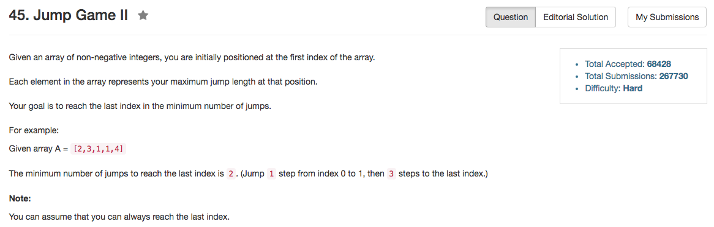

## Algorithm 

- 这个题目其实蛮好想的。
- 我们主要就是看一步可以走多远：如果当前这一步可以从`i`走到`j`，那么我们就看`i -> j`中那一个位置多走一步能走到最远的地方，更新为`nextEnd`
- 如果当前走到了`j`，也就是当前走到了`currentEnd`，实际上就是这一步能走到的最远的距离了，那么`j+1`的位置怎么也得需要多走一步，现在的问题就是这个位置是否被`i -> j`中间某一个位置起跳所覆盖，如果覆盖了，那么`j+1`这个位置是可以达到的。
- 这个题目有一点像广搜的思想，但是实际上应该算是贪心的思想。

## Comment

- 没有什么特别的地方。

## Code

```c++
class Solution {
public:
    int jump(vector<int>& nums) {
        int currentEnd = 0, i = 0, count = 0, nextEnd = 0;
        for (i = 0; i < nums.size(); i++){
            if (i <= currentEnd) {
                nextEnd = (nextEnd > i + nums[i]) ? nextEnd : i + nums[i];
            } else if (i <= nextEnd){
                count++;
                currentEnd = nextEnd;
                nextEnd = i + nums[i];
            } else {
                return -1;
            }
        }
        return count;
    }
};
```
