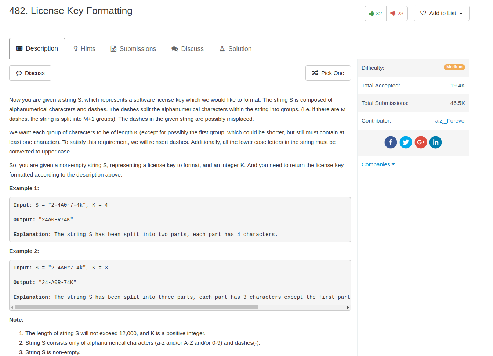

## Algorithm

- 直接的string操作，不知道为什么是medium难度的

## Comment

- 当然还是可以写得更好
- 基本的思路就是先reverse加上了符号以后再reverse回去。

## Code

[别人的简短的解](https://discuss.leetcode.com/topic/74635/one-liner/2)：

```python
class Solution(object):
    def licenseKeyFormatting(self, S, K):
        """
        :type S: str
        :type K: int
        :rtype: str
        """
        s = S.replace('-', '').upper()[::-1]
        return '-'.join([s[i:i+K] for i in xrange(0, len(s), K)])[::-1]
```

我的解

```python
class Solution(object):
    def licenseKeyFormatting(self, S, K):
        """
        :type S: str
        :type K: int
        :rtype: str
        """
        S = ''.join(S.split('-'))
        n = len(S)
        if n % K:
            ans = [S[:(n % K)]]
            p = n % K
        else:
            ans = []
            p = 0
        while p < n:
            ans.append(S[p:(p+K)])
            p += K
        return '-'.join([x.upper() for x in ans])

```
