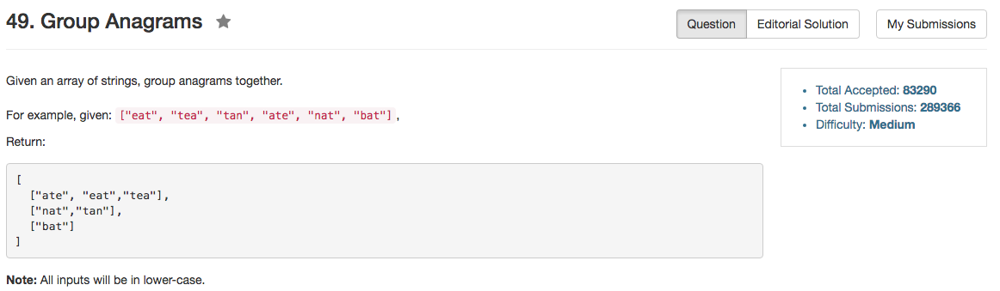

## Algorithm 

- 这个题目也没什么，就是直接Hash就好了。算是在了解C++ STL吧。

## Comment

- 循环迭代的时候还是不那么熟悉，新的用法很有意思。

## Code


```C++
class Solution {
public:
    vector<vector<string>> groupAnagrams(vector<string>& strs) {
        unordered_map<string, unsigned int> Hash;
        vector<vector<string>> ans;
        for (string s : strs){
            string t = getOrder(s);
            if (Hash.count(t)) {
                ans[Hash[t]].push_back(s);
            } else {
                ans.push_back(vector<string>(1, s));
                Hash[t] = ans.size() - 1;
            }
        }
        return ans;
    }
private:
    string getOrder(string s){
        vector<char> count(26, 0);
        for (char ch : s){
            count[ch - 'a']++;
        }
        string anagram;
        for (unsigned int i = 0; i < count.size(); i++){
            anagram += string(count[i], i + 'a');
        }
        return anagram;
    }
};
```
