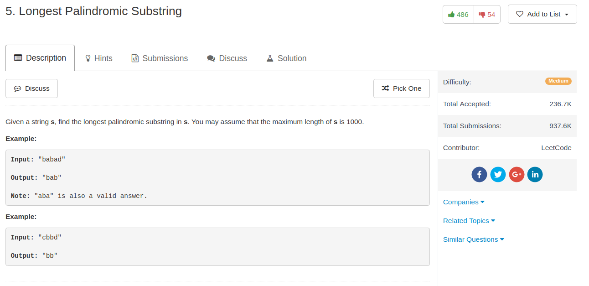

## Algorithm

- 这个题目$O(n^2)$的算法就是比较直接的DP了，有很多种算法，我的算法可能是时空都比较高的。
- $O(n)$的算法，[这里](https://www.felix021.com/blog/read.php?2040)有写，其实也不是很难的样子
- 算法如下：
    - `F[i,j]`表示`s[i]:s[j]`能否组成回文串，显然`F[i,i] = True`
    - `F[i,j] = True` 如果 `s[i] == s[j]` 而且 `F[i+1, j-1] == True`
    - 当然边界要注意一下，比如`i = j + 1`，那么`i + 1 > j - 1`。这个时候只需要满足`s[i] == s[j]`就好了

## Comment

- 这道题目很明显是一道DP

## Code


```python
class Solution(object):
    def longestPalindrome(self, s):
        """
        :type s: str
        :rtype: str
        """
        n = len(s)
        state = [[False] * n for _ in range(n)]
        best_step, best_pos = 1, 0
        for step in range(n):
            flag = False
            for pos in range(n):
                if pos + step >= n:
                    continue
                i, j = pos, pos + step
                if s[i] == s[j] and (i + 1 > j - 1 or state[i + 1][j - 1]):
                    state[i][j] = True
                    best_step, best_pos = step, pos
        #for i in range(n):
        #    print(state[i])
        return s[best_pos:(best_pos + best_step + 1)]
```
