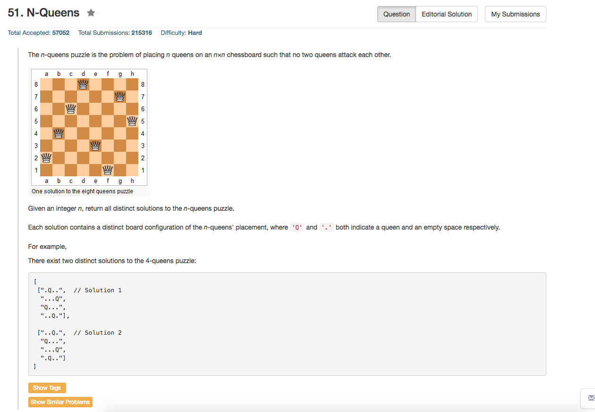

## Algorithm 

- 八皇后，经典题目。
- 要快，就要位运算判断是否可以放置。

## Comment

- 因为是跟51一起做的，所以没什么好说的。

## Code

```C++
class Solution {
public:
    int totalNQueens(int n) {
        return countQueen(n, 0, 0, 0, 0);
    }
private:
    int countQueen(int n, int row, int col, int ldiag, int rdiag){
        if (row == n) return 1;
        int count = 0;
        for (int i = 0; i < n; i++){
            if ( !(col & (1 << i)) && !(ldiag & (1 << (row - i + n))) && !(rdiag & (1 << (row + i))) ) {
                col ^= 1 << i; ldiag ^= 1 << (row - i + n); rdiag ^= 1 << (row + i);
                count = count + countQueen(n, row + 1, col, ldiag, rdiag);
                col ^= 1 << i; ldiag ^= 1 << (row - i + n); rdiag ^= 1 << (row + i);
            }
        }
        return count;
    }
};
```
