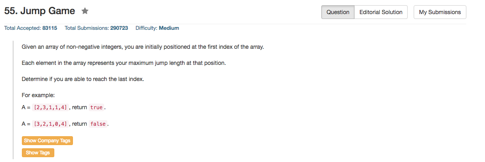

## Algorithm 

- 这个题目就扫一遍就好了，记录当前可以到达的最远距离sum。
- 对于每一个位置`i`：
    1. 如果当前的最远距离`sum >= i`，说明从前面的某一个状态可以走到第`i`个位置
    2. 在1.满足的条件下，`sum = max(sum, i + nums[i])`，也就是说或者通过之前的那个位置走到更远的地方，或者从之前的位置走到`i`然后走到`i`能走到的更远的地方。
    3. 如果发现某个位置`sum < i`，说明从之前的任何一个点都不能到达`i`，那么`return false`
    4. 如果走到了最后，`return true`

## Comment

- 这个题目其实还蛮简单的。

## Code

```C++
class Solution {
public:
    bool canJump(vector<int>& nums) {
        int sum = 0;
        for (int i = 0; i < nums.size(); i++){
            if (sum >= i){
                sum = max(sum, i + nums[i]);
            } else {
                return false;
            }
        }
        return true;
    }
};
```
