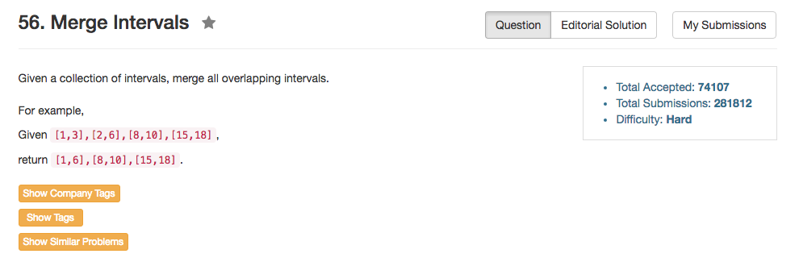

## Algorithm 

- 不明白这个题目为什么是Hard。
- 思路其实很容易：
    1. 把所有的intervals根据`start`从小到大排序，
    2. 然后将intervals逐一加入到结果中。
    3. 如果当前最后一个chunk的终点时间比正在读到的interval起点时间早，那么这个interval就能连到最后一个chunk里面。最后一个chunk就需要根据当前这个interval的终点值来更新自己的终点值。


## Comment

- 这里难的其实是lambda函数用在sort中调整比大小的方式。
- `sort(intervals.begin(), intervals.end(), [](Interval a, Interval b){return a.start < b.start;});`这句话还是蛮值得学习的，我应该是从哪个帖子里面学到的。

## Code

```C++
class Solution {
public:
    vector<Interval> merge(vector<Interval>& intervals) {
        vector<Interval> results;
        sort(intervals.begin(), intervals.end(), [](Interval a, Interval b){return a.start < b.start;});
        for (int i = 0; i != intervals.size(); i++){
            if (results.size() > 0 && results.back().end >= intervals[i].start){
                 results.back().end = max(results.back().end, intervals[i].end);
            } else {
                results.push_back(intervals[i]);
            }
        }
        return results;
    }
};
```
