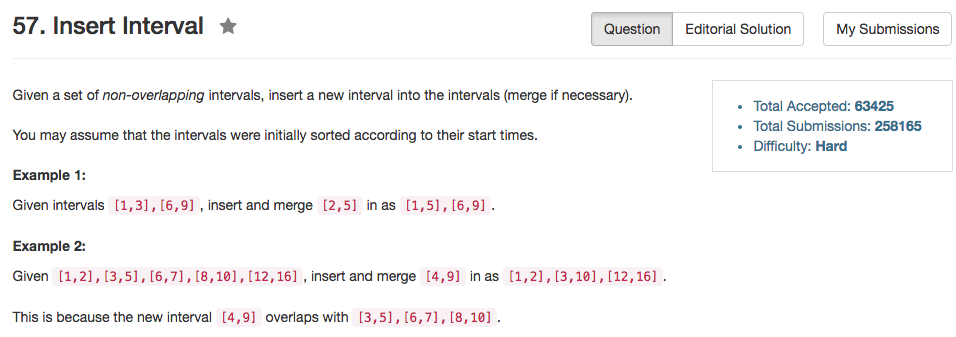

## Algorithm 

- 这道题目大体可以跟56用同样的思路。但是因为要处理`newInterval`，所以事情有点麻烦。
- 思路最清楚的方法如下：  
    1. 先把所有在`newInterval`开始之前就结束的intervals全部先加入答案
    2. 然后把`newInterval`这个区间加入答案
    3. 然后把剩下的区间加入答案，值得注意的是：因为有可能有intervals比newInterval实际上开始的早，但是这里他们是在`newInterval`被加入之后才加入到答案的，所以我们需要在更新的时候，不仅仅需要更新一个chunk中interval的结束时间，还要更新chunk中interval的开始时间，这样才能保证答案正确。
- 这道题目麻烦的地方在于：`newInterval`可以开始于任何一个interval之前、之中、之后。为了满足所有边界条件，这里需要想周到。

## Comment

- 这个题目也不是很难，但是边界条件明显比56难了很多。

## Code

修改之后的代码，要比原始代码更加简洁。

```C++
class Solution {
public:
    vector<Interval> insert(vector<Interval>& intervals, Interval newInterval) {
        vector<Interval> results;
        int position = 0, insertedPos = -1;;
    
        //insert all intervals end before the newInterval starts
        for (position = 0; position != intervals.size() && intervals[position].end < newInterval.start; position++){
            results.push_back(intervals[position]);
        }
        
        //add in the newInterval
        results.push_back(newInterval);
        
        //add all the intervals end after the newInterval starts
        for (; position != intervals.size(); position++){
            if (intervals[position].start <= results.back().end){
                results.back().end = max(results.back().end, intervals[position].end);
                results.back().start = min(results.back().start, intervals[position].start);
            } else {
                results.push_back(intervals[position]);
            }
        }    
        return results;
    }
};
```

第一遍写的代码

```C++
class Solution {
public:
    vector<Interval> insert(vector<Interval>& intervals, Interval newInterval) {
        vector<Interval> results;
        bool haveInserted = false;

        for (int i = 0; i != intervals.size(); i++){
            if (newInterval.start < intervals[i].start && (results.size() == 0 || results.back().end< newInterval.start)){
                results.push_back(newInterval);
                haveInserted = true;
            }
            if (results.size() > 0 && results.back().end >= intervals[i].start){
                results.back().end = max(results.back().end, intervals[i].end);
            } else {
                results.push_back(intervals[i]);
            }
            if (intervals[i].end >= newInterval.start && intervals[i].start <= newInterval.start){
                results.back().end = max(results.back().end, newInterval.end);
                haveInserted = true;
            }
        }
        if (!haveInserted){
            results.push_back(newInterval);
        }
        return results;
    }
};
```
