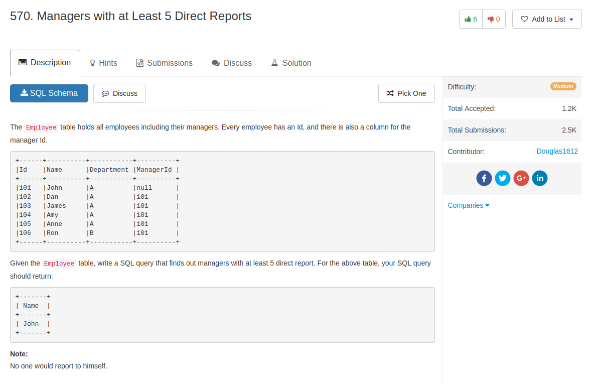

## Comment

- subquery needs alias
- using same table **does not require alias** in subquery. 

## Code

```sql
select Name
from Employee e1
join (
    select e2.ManagerId, count(*) as num
    from Employee e2
    group by e2.ManagerId
) as t on e1.Id = t.ManagerId
where t.num >= 5
```

Another solution from others, filter qualified managerId first by using `having` in subquery. It's a better one.

```sql
SELECT
    Name
FROM
    Employee AS t1 JOIN
    (SELECT
        ManagerId
    FROM
        Employee
    GROUP BY ManagerId
    HAVING COUNT(ManagerId) >= 5) AS t2
    ON t1.Id = t2.ManagerId
```
