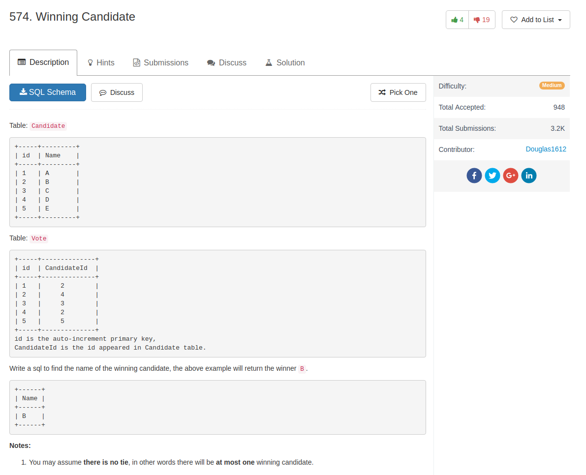

## Knowledge point

1. subquery can use `limit`
2. seems that `where` clause can also use `limit`

## Comment

- subquery should pick the winner first!

## Code

```sql
select c.Name
from Candidate c
join (
    select CandidateId, count(*) as votes
    from Vote
    group by CandidateId
    order by votes desc
    limit 1
) as result
on result.CandidateId = c.id
```

another solution from others

```sql
SELECT
    name AS 'Name'
FROM
    Candidate
        JOIN
    (SELECT
        Candidateid
    FROM
        Vote
    GROUP BY Candidateid
    ORDER BY COUNT(*) DESC
    LIMIT 1) AS winner
WHERE
    Candidate.id = winner.Candidateid
```

`limit` on `where` clause, from online

```sql
select Name
from Candidate
where id =
  (select candidateid
    from Vote
    group by candidateid
    order by count(candidateid) desc
    limit 1)
```
