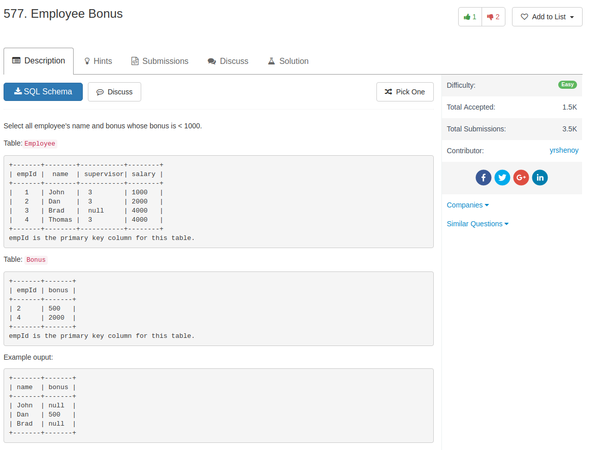

## Knowledge pointer

1. left join and multiple tables

## Code

my code

```sql
SELECT employee.name, Bonus.bonus
FROM employee
LEFT JOIN bonus
ON employee.empId = Bonus.empId
WHERE bonus < 1000 OR bonus IS NULL
```

a better version

```sql
SELECT e.name, b.bonus
FROM Employee e
LEFT JOIN Bonus b
ON e.empId = b.empId
WHERE b.bonus < 1000 OR b.bonus IS NULL
```
