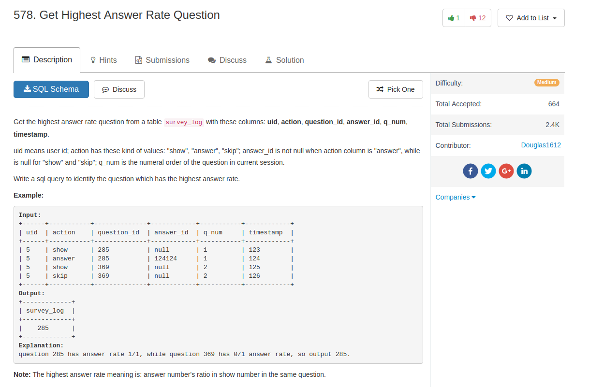

## Comment

- `limit` cannot be used in `in` subquery
- `order by` can take expression into account, such as `(a / b)`


## Code

```sql
select distinct s.question_id as survey_log
from survey_log s
join  (
  select question_id, sum(if(action = 'answer', 1, 0)) / sum(if(action = 'show', 1, 0)) as rate
  from survey_log
  group by question_id
  order by rate desc
  limit 1) as t
on t.question_id = s.question_id
```

another much better solution

```sql
SELECT question_id as survey_log
FROM
(
    SELECT question_id,
         SUM(case when action="answer" THEN 1 ELSE 0 END) as num_answer,
        SUM(case when action="show" THEN 1 ELSE 0 END) as num_show,
    FROM survey_log
    GROUP BY question_id
) as tbl
ORDER BY (num_answer / num_show) DESC
LIMIT 1
```
