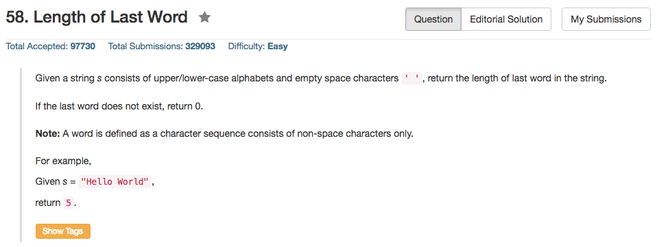

## Algorithm 

- 比较简单的题目，主要是看怎么避开足够的空格。
- 基本上有两种思路：
    1. 一个是从前到后扫描，如果是空格，记录最后一次的长度，然后当前有效单词长度变成0.
    2. 另外一个是从后往前扫描，扫描到第一个单词的时候扫描这个单词有多长。

## Comment

- 我在操作的时候给字符串最后加了一个空格，只是为了处理边界条件的时候方便一点，不用判断有效单词的结尾在最后一个字符的情况。我的代码也不是特别好看。

## Code

```c++
class Solution {
public:
    int lengthOfLastWord(string s) {
        int count = 0;
        s = s + ' ';
        for (int i = 0; i < s.size(); i++){
            if (s[i] == ' '){
                while (i < s.size() && s[i] == ' ') i++;
                if (i == s.size()){
                    return count;
                } else {
                    count = 1;
                }
            } else {
                count ++;
            }
        }
        return 0;
    }
};
```

一下这个C代码写的很紧凑，还蛮优美的，来自[这里](https://leetcode.com/discuss/51749/5-lines-c-solution-0ms)，使用的是上面说到的方法二。

```c
int lengthOfLastWord(char* s) {
  int lastLen = 0;
  char* p = s + strlen(s) -1;
  while(p>=s && isspace(*p)) p--;
  while(p>=s && !isspace(*(p--))) lastLen++;
  return lastLen;
}
```
