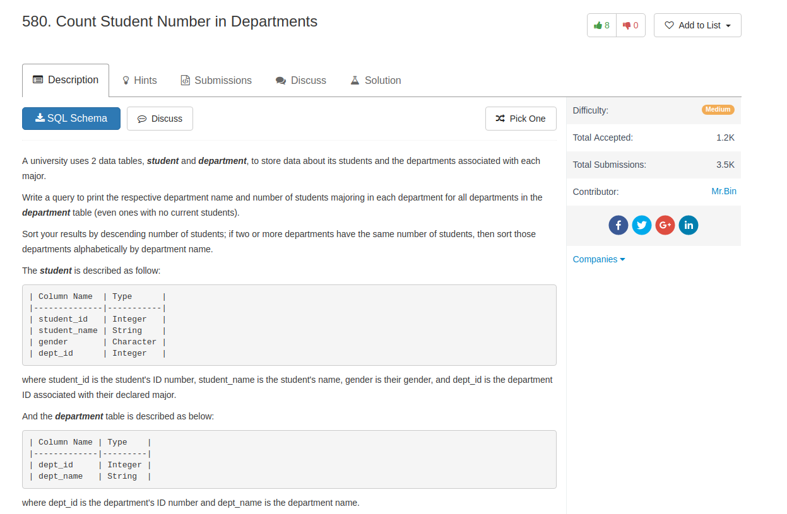
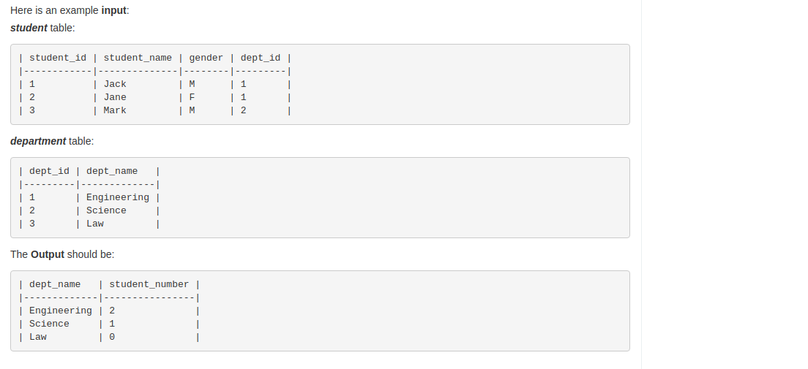

## Knowledge point

- sort by multiple columns:
  - `order by c1 desc, c2 asc`
- `COUNT(student_id)` will not take `NULL` into count

## Comment

- for `in` selection, only one column value can do this.
- do `group by` first, then do `having`

## Code

```sql
select dept_name, sum(if (student_name is NULL, 0, 1)) as student_number
from department
left join student
on student.dept_id = department.dept_id
group by dept_name
order by student_number desc, dept_name asc
```

or use `count` directly, remember: `count` does not take `NULL` in a specific column

```sql
SELECT
    dept_name, COUNT(student_id) AS student_number
FROM
    department
        LEFT OUTER JOIN
    student ON department.dept_id = student.dept_id
GROUP BY department.dept_name
ORDER BY student_number DESC , department.dept_name
```
