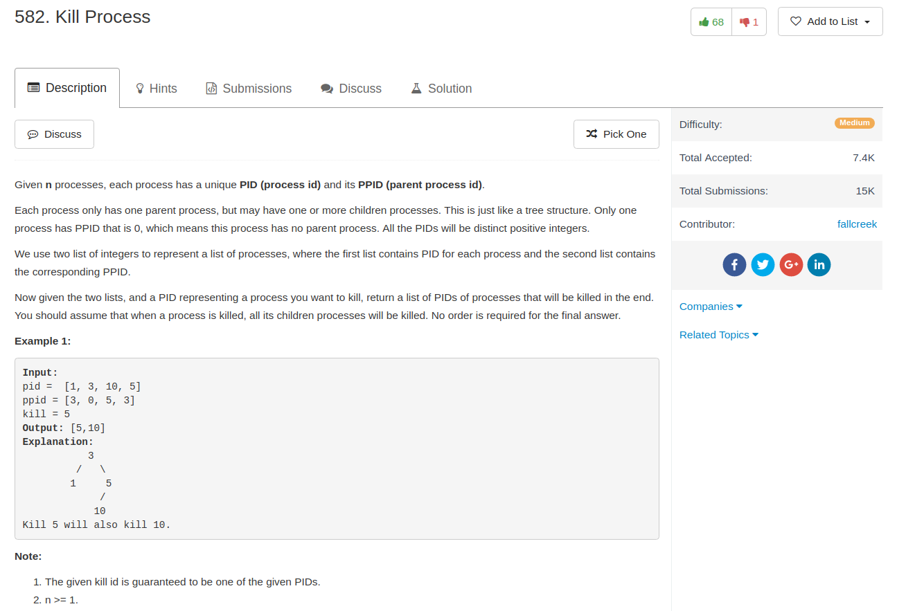

## Algorithm

- 这题目就直接用一个hash(dict)建树，然后直接广搜就好了
- Python我是直接写了一个list当做queue，感觉不是很规范。
## Comment

- 没什么特别的，直接写了BFS

## Code

```python
class Solution:
    def killProcess(self, pid, ppid, kill):
        """
        :type pid: List[int]
        :type ppid: List[int]
        :type kill: int
        :rtype: List[int]
        """
        tree = dict()
        for node, parent in zip(pid, ppid):
            if parent in tree:
                tree[parent].append(node)
            else:
                tree[parent] = [node]
        ans = []
        queue = [kill]
        while queue:
            head = queue[0]
            del queue[0]
            if head in tree:
                queue += tree[head]
            ans.append(head)
        return ans
```
