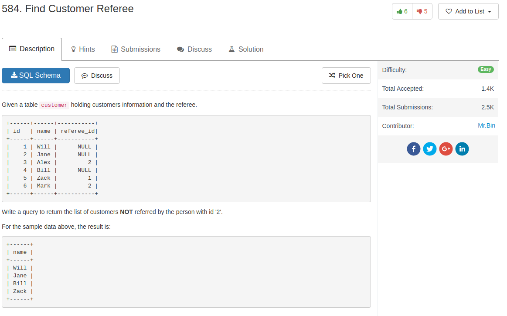

## Knowledge

1. Apparently, we can get access to the columns in the table without needing to refer to the table

## Comment

1. pay attention to `NULL`. When directly refer to the referee_id column, `NULL` rows are ignored

## Code

```sql
SELECT name
FROM customer
WHERE referee_id != 2 OR referee_id IS NULL
```
