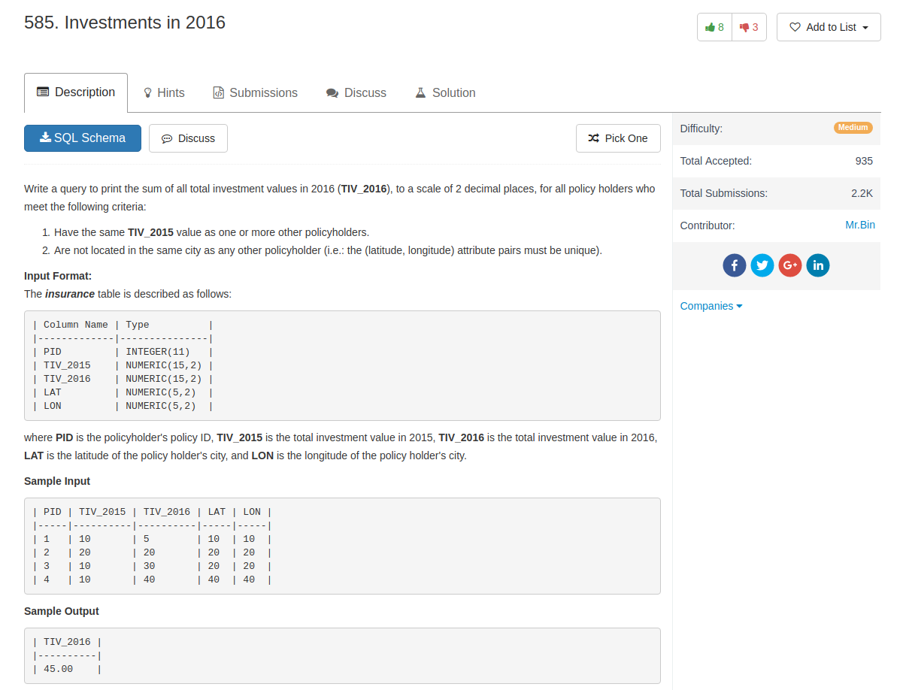

## Comment

- for `in` selection, only one column value can do this.
- do `group by` first, then do `having`

## Code

```sql
select sum(TIV_2016) as TIV_2016
from insurance
where TIV_2015 in (select TIV_2015 from insurance group by TIV_2015 having count(*) > 1)
 and PID in (select PID from insurance group by LAT, LON having count(*) = 1)
```
