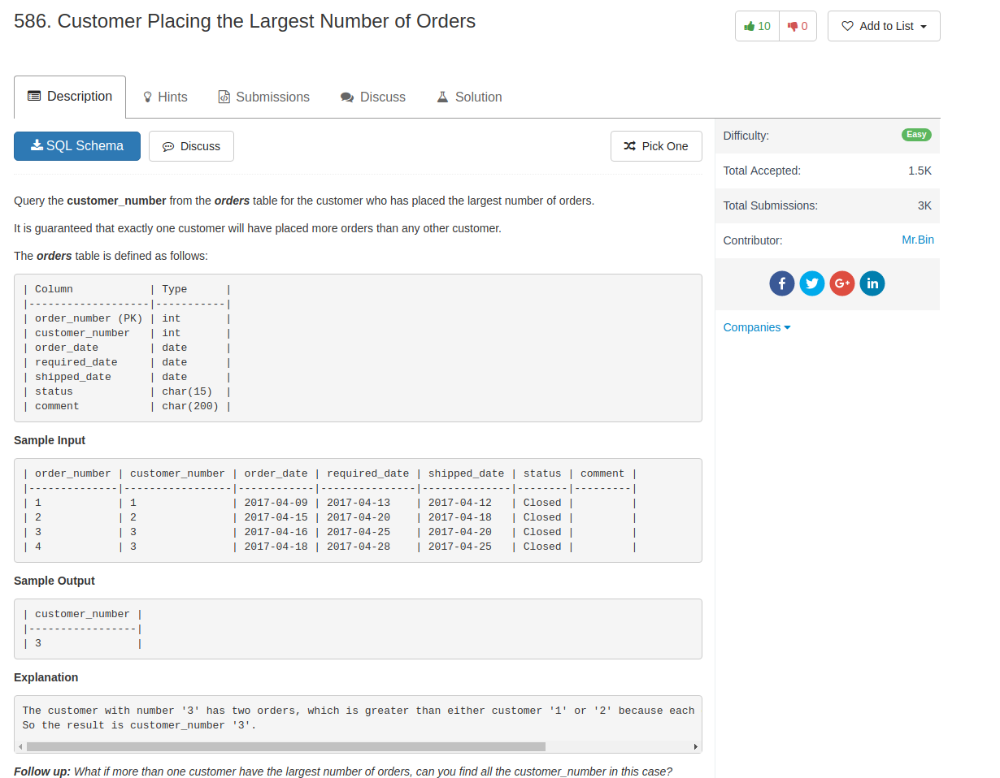

## Knowledge pointer

1. The usage of `limit n`: choose the first n rows
2. `limit` can be combined with `offset m`, which skips the first m rows

## Comment

- This one really just test on the basics of sorting and limits

## Code

```sql
SELECT  customer_number
FROM    orders
GROUP BY customer_number
ORDER BY COUNT(order_number) DESC
LIMIT 1
```
