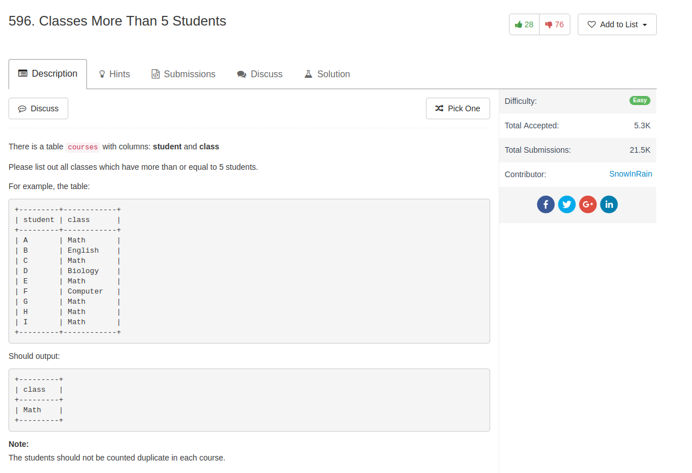

## Comment

- There are duplicate students in one class

## Code

```sql
SELECT class
FROM courses
GROUP BY class
HAVING COUNT(DISTINCT student) >= 5
```

Another solution with sub-query by creating a new table


```sql
SELECT
    class
FROM
    (SELECT
        class, COUNT(DISTINCT student) AS num
    FROM
        courses
    GROUP BY class) AS temp_table
WHERE
    num >= 5
```
