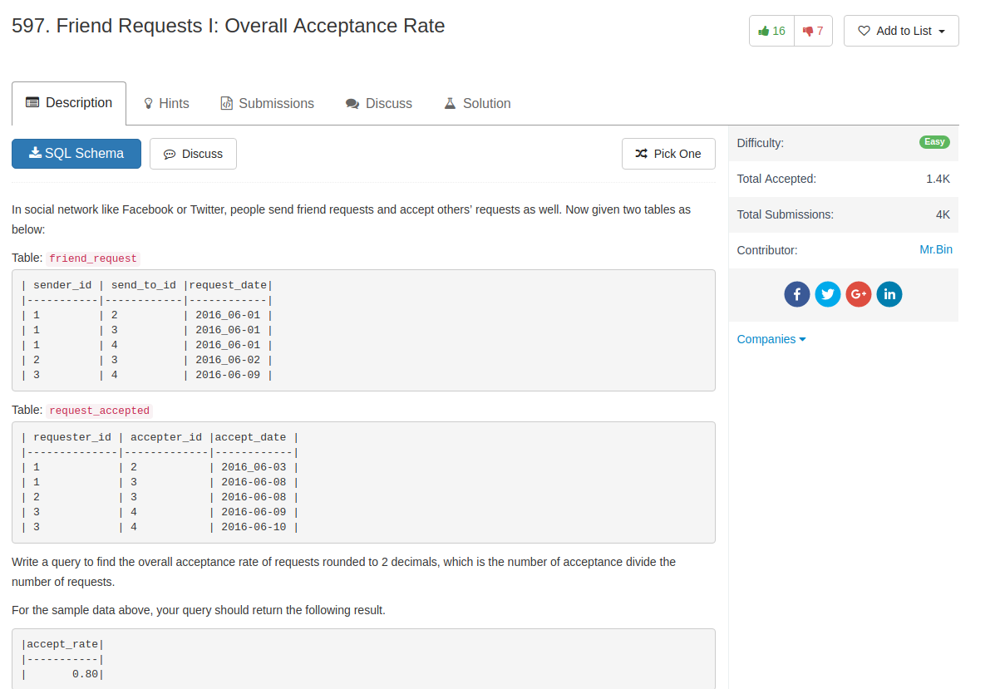
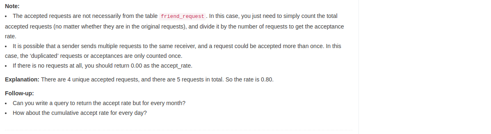

## Comment

- construct a full outer join table
- count distinct items
- use `if` to handle divide-by-zero, `ifull` seems to be a better way to handle this situation

## Code

```sql
select if(
    count(distinct sender_id, send_to_id ) = 0,
    0.00,
    round(count(distinct requester_id, accepter_id ) / count(distinct sender_id, send_to_id ), 2)
)  as accept_rate
from (
    select *
    from friend_request as r
    left join request_accepted as a on r.sender_id = a.requester_id and r.send_to_id = a.accepter_id

    union

    select *
    from friend_request as r
    right join request_accepted as a on r.sender_id = a.requester_id and r.send_to_id = a.accepter_id
) as t
```

A much better way by using `ifnull`

```sql
select
round(
    ifnull(
    (select count(*) from (select distinct requester_id, accepter_id from request_accepted) as A)
    /
    (select count(*) from (select distinct sender_id, send_to_id from friend_request) as B),
    0)
, 2) as accept_rate;
```
