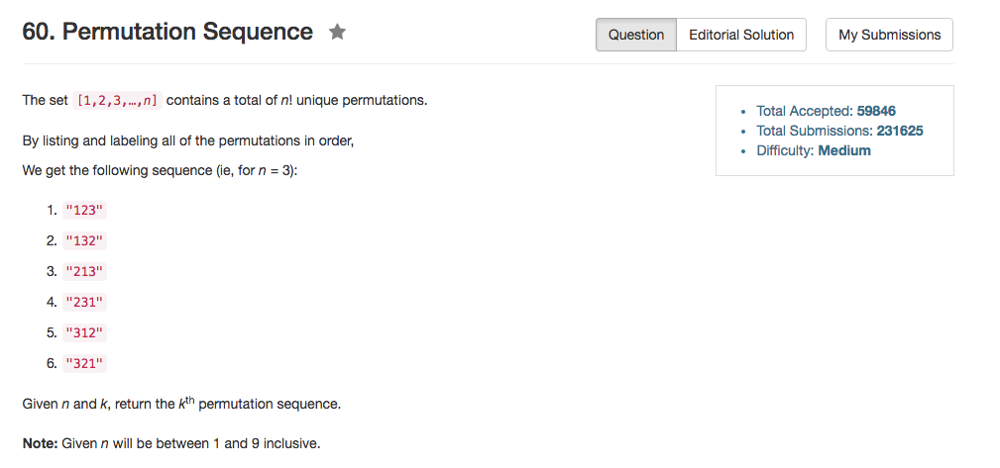

## Algorithm 

- 这个题目其实不难。但是为了方便处理边界条件，我的程序需要用`0 - (n!-1)`编号，而不是`1 - n`编号
- 我的思路和[这里](https://discuss.leetcode.com/topic/17348/explain-like-i-m-five-java-solution-in-o-n)基本上是一样的。在计算某一位是那一个数字的时候，实际上是看剩下有多少位。剩下的位数决定了以某一个数字为开头，一共有多少种情况。
- 比如4!，如果`k == 7`，那么第一位一定是2。因为当第一位是1的时候，编号是0 - 5；第一位是2的时候，编号是6 - 11；以此类推。
- 当确定了第一位以后，我们就需要找第二位。仍然以上面那个例子，4!, `k == 7`，当我们确定第一位是2的时候，那么我们实际上知道它是以2开头的所有序列中的第`7 - 6 = 1`编号的排序。这个时候我们知道第二位应该是1。因为`21xx`占据了编号0 & 1, `23xx`占据了编号2 & 3, `24xx`占据了编号4 & 5。
- 这样的推理我们可以看出，每一次实际上就是算一个区间范围，然后找到在新的范围里面的位置，并且通过位置来判断当前的数字。

## Comment

- 这个题目写了好久，各种边界。
- 以及，我不知道为什么一开始没有使用`int count = k / factor[n - 1];`，而是用一个循环去做的减法。

## Code

```C++
class Solution {
public:
    string getPermutation(int n, int k) {
        vector<int> factor, left;
        string results;
        k = k - 1;
        for (int i = 0; i < 10; i++){
            if (i == 0) {
                factor.push_back(1);
            }else {
                factor.push_back(factor.back() * i);
            }
            left.push_back(i + 1);
        }
        while (n > 0){
            int count = k / factor[n - 1];
            k = k % factor[n - 1];
            results += to_string(left[count]);
            left.erase(left.begin() + count);
            n--;
        }
        return results;
    }
};
```