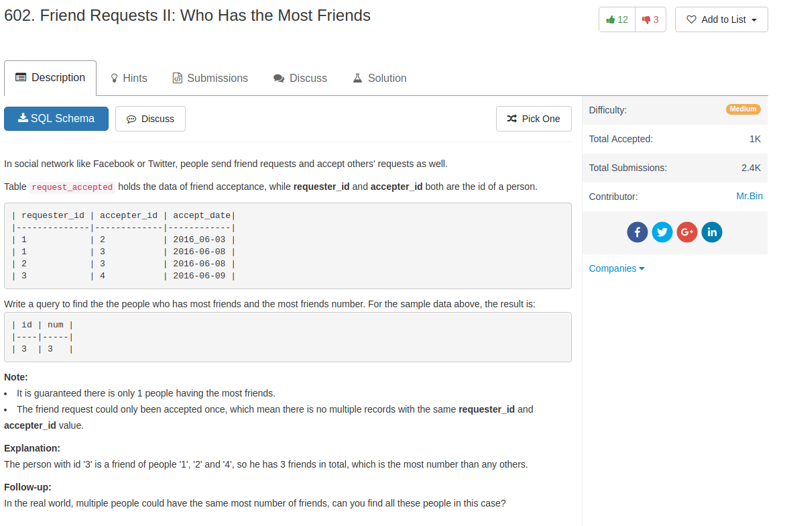

## Comment

- now it's time to understand `union` and `union all`


## Code

the so

```sql
select id1 as id, count(id2) as num
from
  (
    select requester_id as id1, accepter_id as id2
    from request_accepted
    union
    select accepter_id as id1, requester_id as id2
    from request_accepted
  ) tmp1
group by id1
order by num desc
limit 1

```

my answer should be wrong, but apparently the test set is not strong enough

```sql
select r2.requester_id as id,
    (select count(*) from request_accepted where requester_id = r2.requester_id ) +
    (select count(*) from request_accepted where accepter_id = r2.requester_id ) as num
from
    request_accepted r2
order by num desc
limit 1
```
