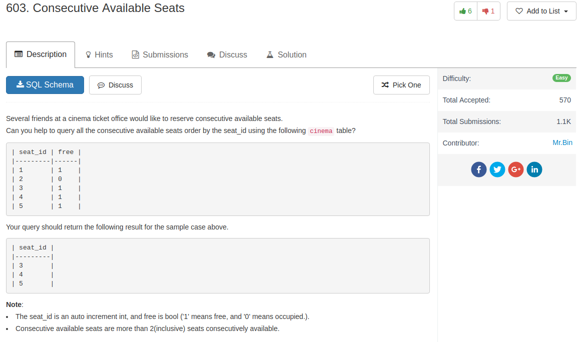

## Knowledge pointer

1. when multiple tables are used, `select` can take the alias of a table before assign the alias to that table (see code)
2. also `distinct` can be used early
3. `()` can be used to group sentence or multiple conditions  
4. column selection from multiple tables seem to be independent.

## Code

Two table version

```sql
SELECT DISTINCT c1.seat_id
FROM cinema c1, cinema c2
WHERE (c1.seat_id = c2.seat_id -1 OR c1.seat_id = c2.seat_id +1)
AND c1.free = 1 AND c2.free = 1
ORDER BY c1.seat_id;
```

Multiple condition, find seat `in` new table version

```sql
SELECT C1.seat_id FROM cinema C1  WHERE
C1.free=1
AND
(
    C1.seat_id+1 IN (SELECT seat_id FROM cinema WHERE free=1)
    OR
    C1.seat_id-1 IN (SELECT seat_id FROM cinema WHERE free=1)
)
ORDER BY C1.seat_id
```

Self-join version

```sql
SELECT DISTINCT a.seat_id
FROM cinema a
JOIN cinema b
ON abs(a.seat_id - b.seat_id) = 1
AND a.free=true AND b.free=true
ORDER BY a.seat_id;
```
