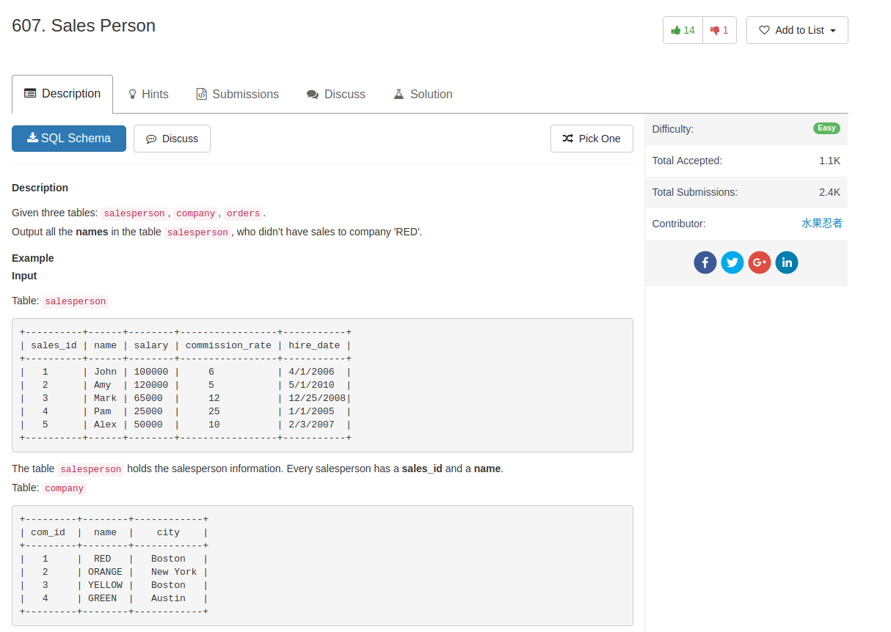
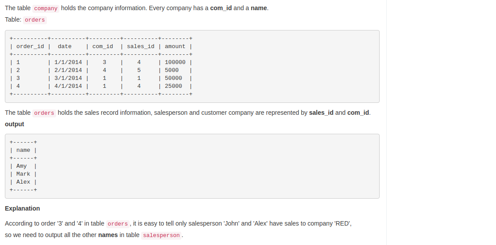

## Code

My answer: get all salesman that do have business with 'RED', and select out

```sql
select name
from salesperson
where name not in (
    select s.name
    from salesperson s, company c, orders o
    where s.sales_id = o.sales_id and c.com_id = o.com_id and c.name = 'RED')
```

Some out join strategy, maybe better: out join orders and company 

```sql
SELECT
    s.name
FROM
    salesperson s
WHERE
    s.sales_id NOT IN (SELECT
            o.sales_id
        FROM
            orders o
                LEFT JOIN
            company c ON o.com_id = c.com_id
        WHERE
            c.name = 'RED')
```
