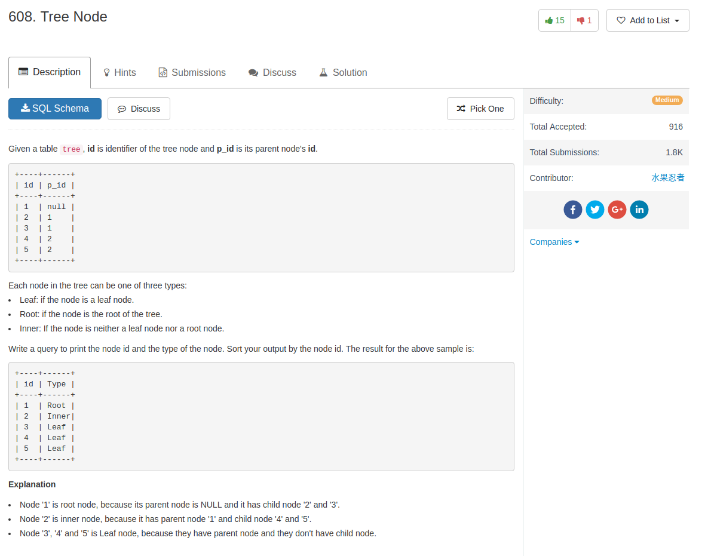
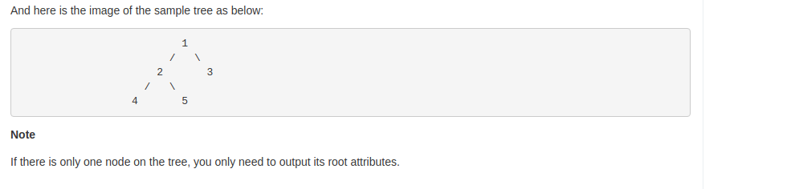

## Knowledge point

1. if want get `count`, we can use subquery `select count(*) from ...`

## Comment

- All solutions are from online


## Code

my answer

```sql
select t0.id as Id,
    if(isnull(t0.p_id),
       'Root',
       if((select count(*) from tree where p_id = t0.id) = 0,
          'Leaf',
          'Inner')
      ) as Type
from tree t0
order by t0.id
```

another similar answre

```sql
SELECT
    atree.id,
    IF(ISNULL(atree.p_id),
        'Root',
        IF(atree.id IN (SELECT p_id FROM tree), 'Inner','Leaf')) Type
FROM
    tree atree
ORDER BY atree.id
```

provided answer that use `case when`
```sql
SELECT
    id AS `Id`,
    CASE
        WHEN tree.id = (SELECT atree.id FROM tree atree WHERE atree.p_id IS NULL)
          THEN 'Root'
        WHEN tree.id IN (SELECT atree.p_id FROM tree atree)
          THEN 'Inner'
        ELSE 'Leaf'
    END AS Type
FROM
    tree
ORDER BY `Id`
```

separete different cases and `union` all of them

```sql
SELECT
    id, 'Root' AS Type
FROM
    tree
WHERE
    p_id IS NULL

UNION

SELECT
    id, 'Leaf' AS Type
FROM
    tree
WHERE
    id NOT IN (SELECT DISTINCT
            p_id
        FROM
            tree
        WHERE
            p_id IS NOT NULL)
        AND p_id IS NOT NULL

UNION

SELECT
    id, 'Inner' AS Type
FROM
    tree
WHERE
    id IN (SELECT DISTINCT
            p_id
        FROM
            tree
        WHERE
            p_id IS NOT NULL)
        AND p_id IS NOT NULL
ORDER BY id;
```
