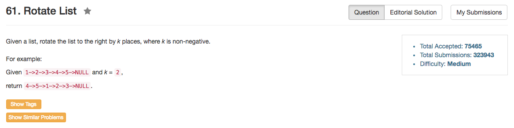

## Algorithm 

- 这个题目其实不难想，但是边界条件需要很注意。
- 如果`k < n`，那么就让一个`fast`指针先走k步，然后`fast`继续走，`slow`从头开始走，当`fast`走到最后一个结点的时候，`slow`刚好走到转折点，然后交换一下链接就好
- 问题就出在`k > n`：
    1. 我们需要知道`n`是多大，所以我遍历了一遍链表。
    2. 我们实际上只要移动`k % n`步就可以了，因为移动`n`步就回到开始了。
    3. 我们要注意`n == 0`的情况。
- 当然，也可以用一个pointer就够了，比如[这里](https://discuss.leetcode.com/topic/7293/c-simple-algorithm-with-explanation/2)这种解。

## Comment

- 没有想清楚当`k > n`的时候是怎么回事。在这个边界条件上耽误了很多时间。

## Code

```C++
class Solution {
public:
    int trap(vector<int>& height) {
        stack<int> leftEnd;
        int water = 0, n = height.size();
        for (int i = 0; i < n; i++){
            while (leftEnd.size() && height[i] >= height[leftEnd.top()]){
                int stage = leftEnd.top();
                leftEnd.pop();
                if (leftEnd.size()) {
                    water += (min(height[i], height[leftEnd.top()]) - height[stage]) * (i - (leftEnd.top() + 1));
                }
            }
            leftEnd.push(i);
        }
        return water;
    }
};
```