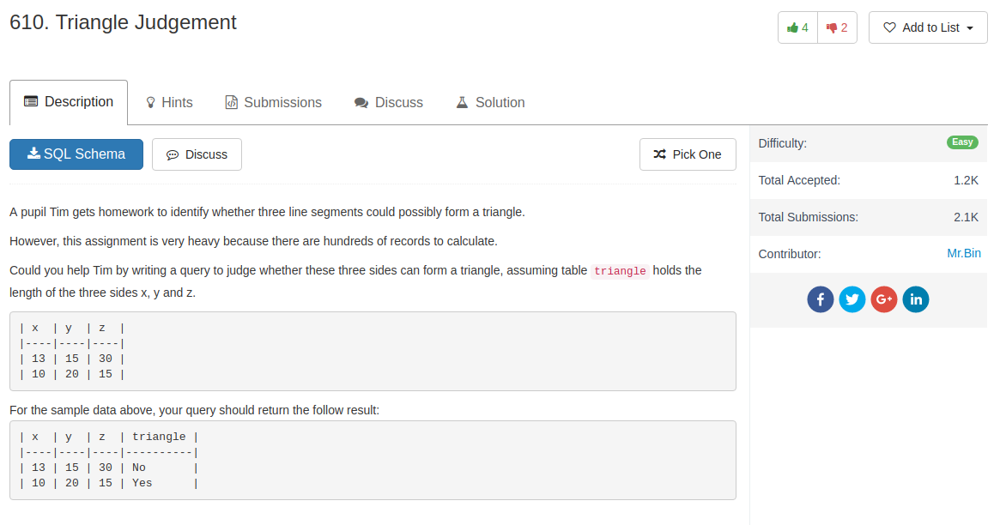

## Knowledge

1. `IF ()` sentence can give a result and assigned to a new variable using `as`
2. `CASE WHEN ... THEN ... ELSE ... END` can have similar effects


## Code

Using `IF`

```sql
SELECT *, IF(x+y>z and x+z>y and y+z>x, 'Yes', 'No') as triangle
FROM triangle
```

Using `CASE WHEN`

```sql
SELECT x, y, z,
CASE WHEN x+y<=z OR
          x+z<=y OR
          y+z<=x
     THEN 'No'
     ELSE 'Yes'
END AS 'triangle'
FROM triangle;
```
