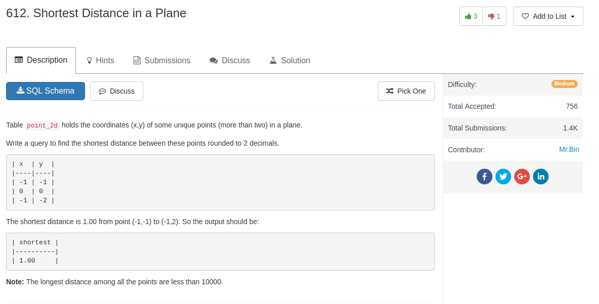

## Knowledge point

1. `pow(x, n)` function as power function

## Comment

- I think cartesian product is good, although others use join

## Code

```sql
select round(min(sqrt((p1.x - p2.x) * (p1.x - p2.x) +  (p1.y - p2.y) * (p1.y - p2.y) )),2) as shortest
from point_2d p1, point_2d p2
where not (p1.x = p2.x and p1.y = p2.y)
```

another solution from others, using `join`

```sql
SELECT
    ROUND(SQRT(MIN((POW(p1.x - p2.x, 2) + POW(p1.y - p2.y, 2)))), 2) AS shortest
FROM
    point_2d p1
        JOIN
    point_2d p2 ON p1.x != p2.x OR p1.y != p2.y
```
