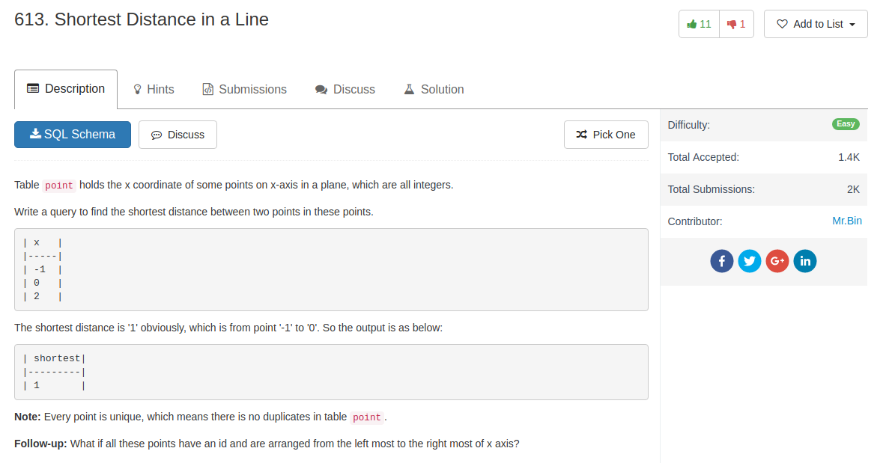

## Knowledge pointer

1. you can SELECT the same table multiple times
2. you can do self-join or not


## Code

Self join version

```sql
SELECT MIN(ABS(P1.x - P2.x)) AS shortest FROM point AS P1
JOIN point AS P2 ON P1.x <> P2.x
```

Not Self join version

```sql
SELECT min(abs(p1.x-p2.x)) AS shortest FROM point p1, point p2
WHERE p1.x<>p2.x;
```

Extension: if the table has ID that are arranged from the left most to the right most of x axis

```sql
SELECT MIN(P1.x - P2.x) AS shortest
FROM point P1 JOIN point P2 ON P1.id = P2.id + 1
WHERE P1.id > 1;
```
