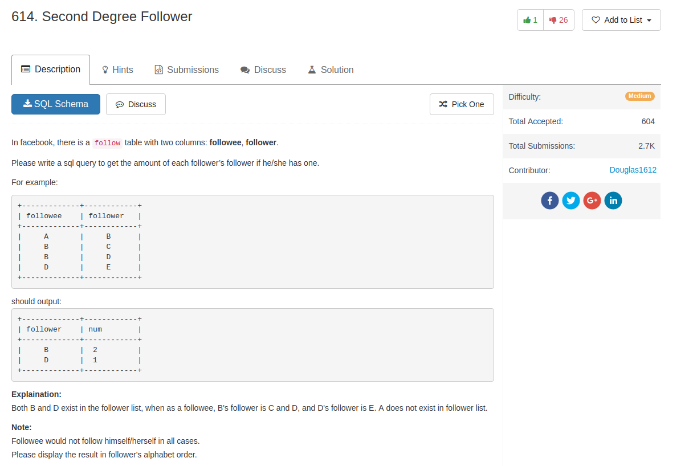

## Comment

- pay attention to duplicate rows of followee-follower 

## Code

```sql
select f1.follower, count(distinct f2.follower, f2.followee) as num
from follow as f1
join follow as f2 on f1.follower = f2.followee
group by f1.follower
order by f1.follower
```
