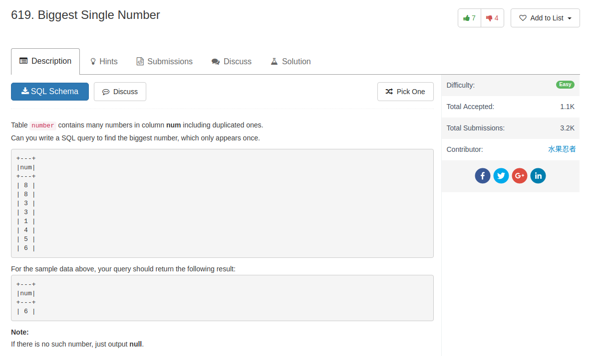

## Knowledge pointer

1. The usage of `limit n`: choose the first n rows
2. `limit` can be combined with `offset m`, which skips the first m rows

## Comment

- This one really just test on the basics of sorting and limits

## Code

my code, use sub-query

```sql
select max(num) as num
from
(
    select num, count(*) as c
    from number
    group by num
) as stat
where c = 1
```

other answer 1: select max not in count > 1

```sql
select max(n.num) as num
from number n
where n.num not in
(select num from number group by num having count(num) > 1)
```

or similarly just get the count for each number

```sql
Select
    max(n.num) as num
from
    number n
where
    (Select count(num) from number where num = n.num) = 1;
```
