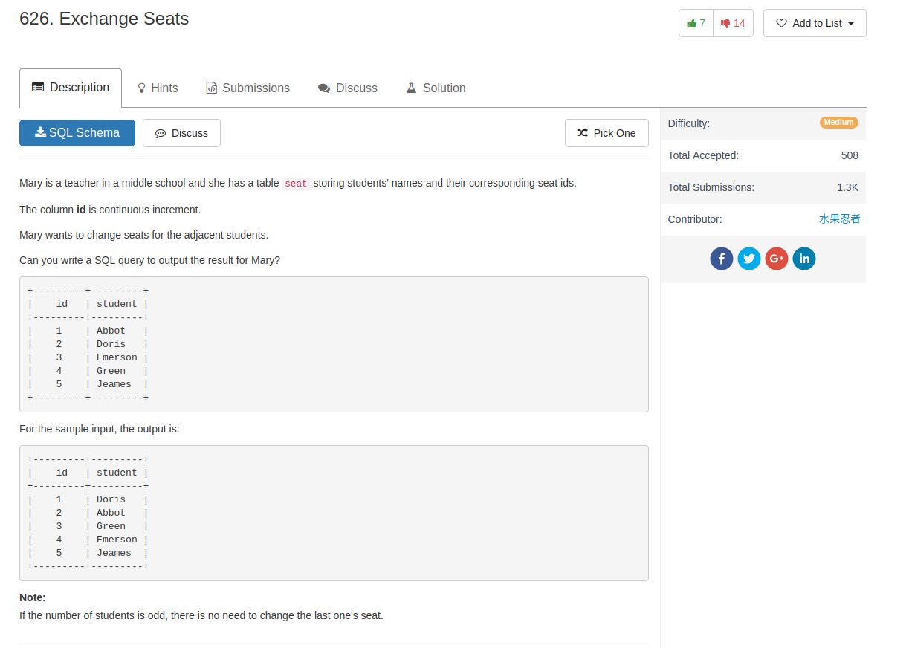

## Comment

- just use nested `if` if fine
- if return single value, a whole `select` clause can be used in `select`

## Code

```sql
select if(id % 2 = 1,
  id + if(id = (select count(*) from seat s), 0, 1),
  id - 1) as id, student
from seat
order by id asc
```
