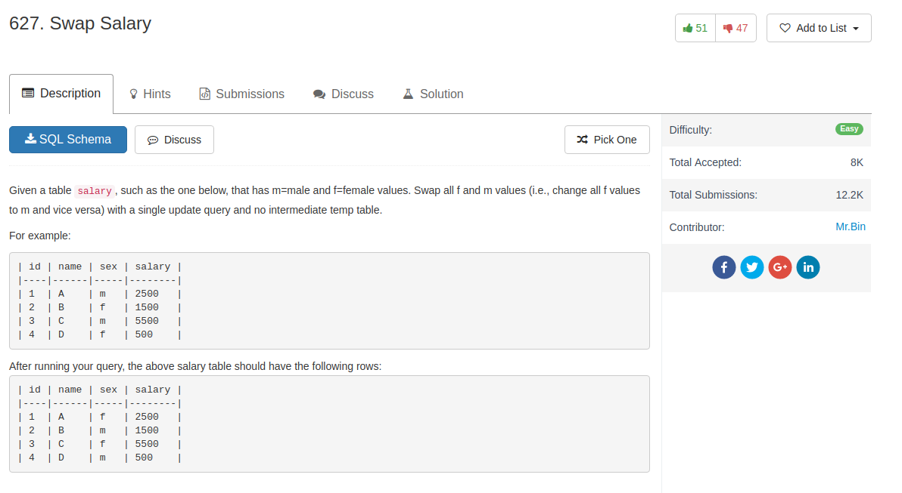

## Knowledge pointer

1. learn the `if-else` control flow
2. I basically just learn from the answers

## Code

`IF` condition version

```sql
UPDATE salary
SET sex = IF(sex = 'm', 'f', 'm')
```

`CASE WHEN` version

```sql
UPDATE salary
    SET sex  = (CASE WHEN sex = 'm'
        THEN  'f'
        ELSE 'm'
        END)
```
