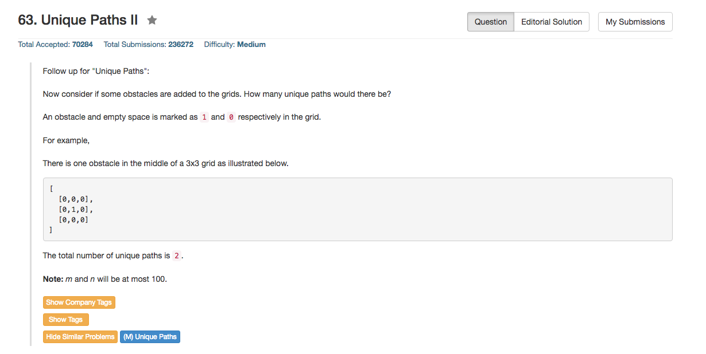

## Algorithm 

- 这个题目其实就是很简单的Counting，与之前的题目不一样的地方在于有obstacle
- 有obstacle并不妨碍以前的算法，只要把到这个有obstacle的位置设置为0就好了，然后继续count

## Comment

- 对现在写的这个版本比较满意，因为最大程度地把边界条件整合到了循环里面。

## Code

```C++
class Solution {
public:
    int uniquePathsWithObstacles(vector<vector<int>>& obstacleGrid) {
        if (obstacleGrid.size() == 0 || obstacleGrid[0].size() == 0) return 0;
        int n = obstacleGrid.size(), m = obstacleGrid[0].size();
        for (int i = 0; i < n; i++){ 
            for (int j = 0; j < m; j++){
                if (obstacleGrid[i][j] == 1){
                    obstacleGrid[i][j] = 0;
                } else {
                    int top = (i < 1) ? 0 : obstacleGrid[i - 1][j];
                    int left = (j < 1) ? 0 : obstacleGrid[i][j - 1];
                    obstacleGrid[i][j] = (i == 0 && j == 0) ? 1 : top + left;
                }
            }
        }
        return obstacleGrid[n - 1][m - 1];
    }
};
```

