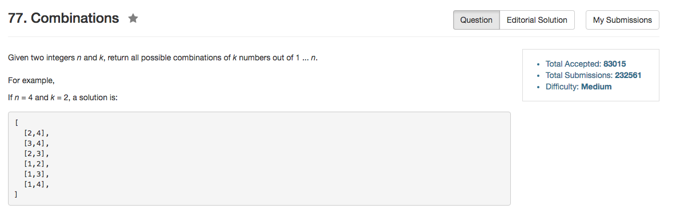

## Algorithm 

- 就是直接的回溯。
- 对于每一个数字：要么选择，要么不选择。如果是选当前数字，就是在剩下的数字里面选`k-1`个；如果不选当前数字，就是在剩下的数字里面选`k`个。

## Comment

- 边界条件的判断一开始写错了。一开始没有先判断`if (k == 0)`，所以导致很多答案没有被记录。

## Code


```C++
class Solution {
public:
    vector<vector<int>> combine(int n, int k) {
        search(n, 1, k);
        return results;
    }
private:
    vector<vector<int>> results;
    vector<int> tmpResults;
    void search(int n, int count, int k){
        if (k == 0){
            results.push_back(tmpResults);
            return;
        }
        if (count > n) return;
        search(n, count + 1, k);
        tmpResults.push_back(count);
        search(n, count + 1, k - 1);
        tmpResults.pop_back();
    }
};
```
