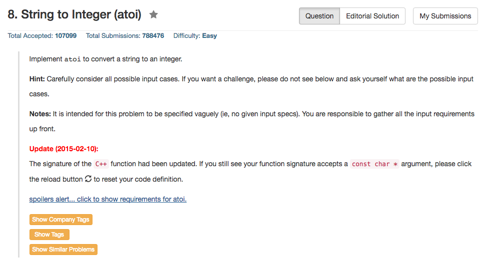

## Algorithm 

- 这道题目看似简单，但是非常不好写
- 要考虑如下边界情况
    1. 数字前面有无用的空格
    2. 数字可能由一个+或者-开始
    3. 一旦数字开始，就只读到合法数字字符。数字后面的非数字字符都对数字不产生任何影响
    4. 数字可能超过上界(INT_MAX: 2147483647)或者下界(INT_MIN: -2147483648)
    5. 如果数字是非法串，返回0.

## Comment

- 数据如`+-2`和`+0 123`这种乱糟糟的形式都是要注意的。

## Code

```c++
class Solution {
public:
    int myAtoi(string str) {
        int ans = 0, sign = 0, i = 0;
        //space ahead
        while (i < str.size() && str[i] == ' ') i++;
        //sign
        if (str[i] == '+') {
                sign = +1, i++;
        } else if (str[i] == '-') {
                sign = -1, i++;
        } 
        //number
        while (i < str.size() && str[i] >= '0' && str[i] <= '9'){
                if (ans > 214748364)
                    return (sign >= 0) ? INT_MAX : INT_MIN;
                else if (ans == 214748364 && str[i] >= '8')
                    return (sign >= 0) ? INT_MAX : INT_MIN;
                else 
                    ans = ans * 10 + str[i] - '0';
                i++;
        } 
        //return results;
        return (sign >= 0) ? ans : -ans;
    }
};
```
