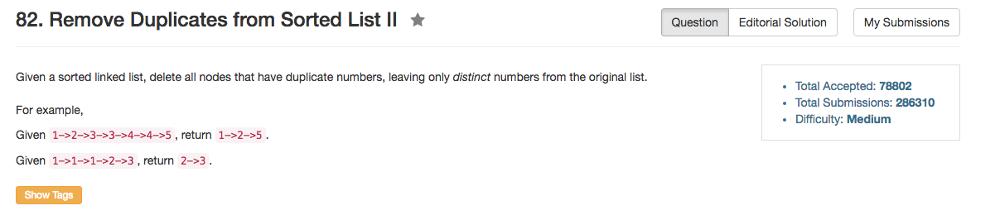

## Algorithm 

- 这道题目其实比较直白，主要是链表的数据结构处理。
- 我这里用了pointer to pointer。用这种方法可以避免使用dummy variable，但是问题在于pointer to pointer经常容易写错，我写错了很多次。
- 另外，这道题目用递归解，可以非常优美。解来自[这里](https://discuss.leetcode.com/topic/12892/simple-and-clear-c-recursive-solution)

## Comment

- 这个题目用递归做很有意思，很简洁。这是第二个我看到的用递归能够是链表操作变得简洁的例子了。

## Code

我的解

```C++
class Solution {
public:
    ListNode* deleteDuplicates(ListNode* head) {
        ListNode** ptr = &head;
        while (*ptr){
            int val = (*ptr)->val;
            while ((*ptr)->next && (*ptr)->next->next && (*ptr)->next->next->val == val){
              (*ptr)->next->next = (*ptr)->next->next->next;  
            } 
            if ((*ptr)->next && (*ptr)->next->val == val){
                *ptr = (*ptr)->next->next;
            } else {
                ptr = &(*ptr)->next;
            }
        }
        return head;
    }
};
```

来自[这里](https://discuss.leetcode.com/topic/7224/is-this-the-best-c-solution)的，跟我类似的解，不过写的比我更清楚，我觉得。

```c++
class Solution {
public:
    ListNode *deleteDuplicates(ListNode *head) {
        ListNode **runner = &head;
        
        if(!head || !head->next)return head;
        
        while(*runner)
        {
            if((*runner)->next && (*runner)->next->val == (*runner)->val)
            {
                ListNode *temp = *runner;
                while(temp && (*runner)->val == temp->val)
                    temp = temp->next;
                
                *runner = temp;
            }
            else
                runner = &((*runner)->next);
        }
        
        return head;
    }
};
```

来自[这里](https://discuss.leetcode.com/topic/12892/simple-and-clear-c-recursive-solution)的递归的解，非常有意思，而且很简洁。

```C++
class Solution {
public:
    ListNode* deleteDuplicates(ListNode* head) {
        if (!head) return 0;
        if (!head->next) return head;
        
        int val = head->val;
        ListNode* p = head->next;
        
        if (p->val != val) {
            head->next = deleteDuplicates(p);
            return head;
        } else {
            while (p && p->val == val) p = p->next;
            return deleteDuplicates(p);
        }
    }
};
```