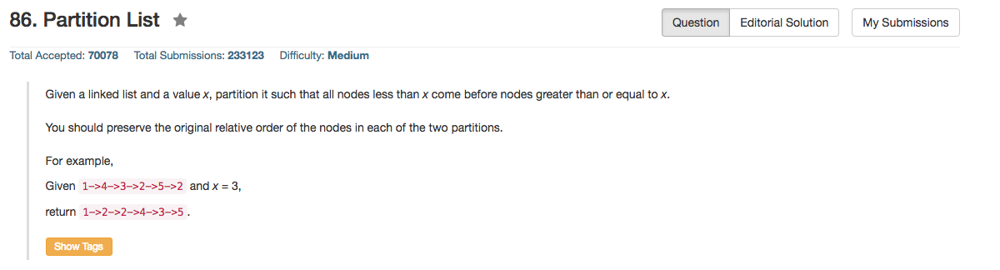

## Algorithm 

- 这个题目没什么难的，就是把一个链表分成两个链表。
- 但是这个题目要写的好看还蛮难的，我写的就非常不好看。
- 很多比较好的写法是用一个dummy pointer来引导每一个链表，这个dummy->next才是真正的链表的第一个有元素，这样能够统一整个链表的操作，值得学习。比如[这里](https://discuss.leetcode.com/topic/7005/very-concise-one-pass-solution)的解法就很简洁。

## Comment

- 边界条件很多啊。
    1. 空链表
    2. 只有一个元素，且这个元素小于x
    3. 只有一个元素，且这个元素大于x
    4. 所有的元素都小于x
    5. 所有的元素都大于x
    6. 剩下的其他情况。

## Code

首先还是放简洁的解法吧，使用Dummy Pointer来引导链表，解法来自[这里](https://discuss.leetcode.com/topic/7005/very-concise-one-pass-solution)

```C++
ListNode *partition(ListNode *head, int x) {
    ListNode node1(0), node2(0);
    ListNode *p1 = &node1, *p2 = &node2;
    while (head) {
        if (head->val < x)
            p1 = p1->next = head;
        else
            p2 = p2->next = head;
        head = head->next;
    }
    p2->next = NULL;
    p1->next = node2.next;
    return node1.next;
}
```

```C++
class Solution {
public:
    ListNode* partition(ListNode* head, int x) {
        ListNode*head1 = NULL, *head2 = NULL, *walk = head, *tail1 = NULL, *tail2 = NULL;
        while (walk){
            if (walk->val < x){
                if (head1 == NULL){
                    head1 = walk;
                    tail1 = walk;
                } else {
                    tail1->next = walk;
                    tail1 = walk;
                }
            } else {
                if (head2 == NULL){
                    head2 = walk;
                    tail2 = walk;
                } else {
                    tail2->next = walk;
                    tail2 = walk;
                }
            }
            walk = walk->next;
        }
        if (head1 == NULL) {
            head1 = head2;
        } else {
            tail1->next = head2;
        }
        if (tail2 && tail2->next) tail2->next = NULL;
        return head1;
    }
};
```

