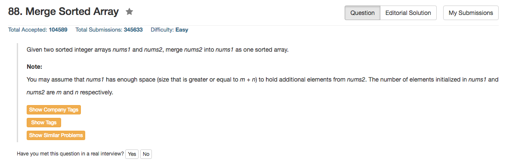

## Algorithm 

- 因为题目说nums1的长度大于m+n，那就可以扫一遍数组并且直接在num1上面更新了。
- 重要的规则是**从后往前**更新，因为nums1[m+n]一开始是没有值的，从后往前的更新顺序可以防止num1前面的数据被覆盖。
- 其实这个问题应该要问一下到底这个sorted array是从大到小排序的还是从小到大排序的，我这里当然是默认了从小到大排序的。

## Comment

- 基本运算，但是还是要注意一下边界条件的。

## Code

```c++
class Solution {
public:
    void merge(vector<int>& nums1, int m, vector<int>& nums2, int n) {
        for (int i = n+m-1; i >= 0; i--){
            nums1[i] = ((n <= 0) || ((m > 0) && (nums1[m - 1] > nums2[n - 1]))) ? nums1[--m] : nums2[--n];
        }
    }
};
```