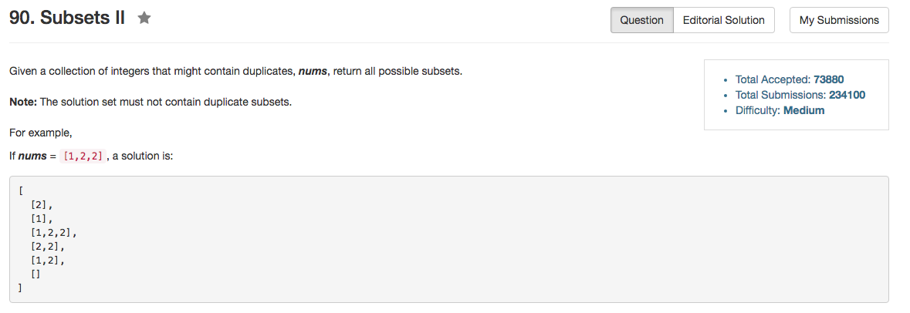

## Algorithm 

- 这道题目有不同的解法。
- 我的解法是比较粗暴的：先统计有多少个不同的元素，然后在选择subset的时候，就是每一个unique的元素选择0,1,2...个，每种情况都试一下，然后回溯。
- 但是[这里](https://discuss.leetcode.com/topic/3601/simple-iterative-solution)有一个更好的方法
    1. 首先排序，然后这样保证相同的元素在相邻的位置。
    2. 从头开始读每一个元素，如果当前元素`i`跟之前的元素都不一样，那么所有之前产生过的子集都可以通过添加一个元素`i`来得到新的子集。
    3. 如果当前元素`i`之前已经出现过了，那么就只在上一次该元素产生所有结果中，增加一个元素`i`可以得到新的子集。要注意的是，在这个范围之外的其他子集，如果增加一个`i`元素，会得到一个已经得到的子集。
    4. 这个程序并不是那么好写，但是帖子里面给出的程序确实很不错。

## Comment

- 这道题目还是想复杂了。

## Code

来自[这里](https://discuss.leetcode.com/topic/3601/simple-iterative-solution)的解：

```C++
vector<vector<int> > subsetsWithDup(vector<int> &S) {
    sort(S.begin(), S.end());
    vector<vector<int>> ret = {{}};
    int size = 0, startIndex = 0;
    for (int i = 0; i < S.size(); i++) {
        startIndex = i >= 1 && S[i] == S[i - 1] ? size : 0;
        size = ret.size();
        for (int j = startIndex; j < size; j++) {
            vector<int> temp = ret[j];
            temp.push_back(S[i]);
            ret.push_back(temp);
        }
    }
    return ret;
}
```

我的解，程序比较长，而且不是很优。

```C++
class Solution {
public:
    vector<vector<int>> subsetsWithDup(vector<int>& nums) {
        
        unordered_map<int, int> Hash;
        for (auto num : nums){
            if (Hash.count(num)) {
                unique[Hash[num]].second++;
            } else {
                unique.push_back(pair<int, int>{num, 1});
                Hash[num] = unique.size() - 1;
            }
        }
        search(0, unique.size());
        return results;
    }
private:
    vector<pair<int, int>> unique;
    vector<vector<int>> results;
    vector<int> tmpResults;
    void search(int count, int n){
        if (count >= n){
            results.push_back(tmpResults);
        } else {
            pair<int, int> element = unique[count];
            for (int i = 0; i <= element.second; i++){
                for (int j = 0; j < i; j++) {
                    tmpResults.push_back(element.first);
                }
                search(count + 1, n);
                for (int j = 0; j < i; j++) {
                    tmpResults.pop_back();
                }
            }
        }
    }
};
```
