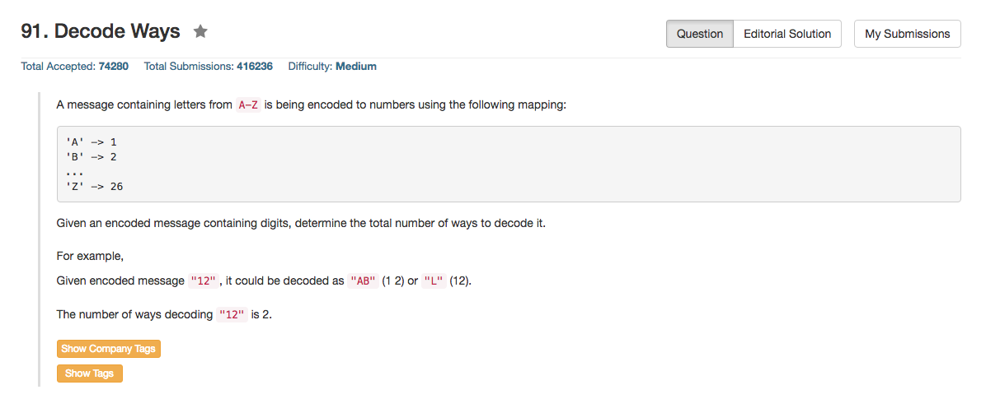

## Algorithm 

- 这个题目可以认为是dynamic programming，但是也可以认为是简单的counting
- `F[i]`表示截止到第`i`个字符所得到的decode的解法总数
    1. 如果`s[i]`是valid，那么F[i] += F[i - 1]
        - **NOTE:** 这个时候`s[i]`必须是1 - 9; 如果是0，则是invalid
    2. 如果`s[i-1]-s[i]`是valid，那么F[i] += F[i - 2]
        - **NOTE:** 这个时候数字应该是`10 - 26`；否则是invalid
    3. 边界条件要特别注意，比如s[0], s[1]的时候，要把边界条件整合到循环中比较麻烦
- [这里](https://discuss.leetcode.com/topic/7025/a-concise-dp-solution)的这个程序写的很好，虽然思路是一样的，但是在实现的时候其实也就用了两个指针，非常精美。

## Comment

- 一开始invalid的判断搞错了，主要是忽略了`s[i] == '0'`的情况
- 程序因为边界条件写的非常丑。

## Code

```C++
class Solution {
public:
    int numDecodings(string s) {
        int n = s.size(), oneBack, twoBack;
        if (0 == n) return 0;
        vector<int> ans(n);
        ans[0] = (s[0] - '0' > 0) ? 1 : 0;
        for (int i = 1; i < n; i++){
            int oneBackLetter = s[i] - '0', twoBackLetter = (s[i - 1] - '0') * 10 + (s[i] - '0');
            oneBack = (oneBackLetter > 0) ? ans[i - 1] : 0;
            if (twoBackLetter <= 26 && twoBackLetter >= 10) {
                twoBack = (i >= 2) ? ans[i - 2] : 1;   
            } else {
                twoBack = 0;
            }
            if (0 == oneBack + twoBack){
                return 0;
            } else {
                ans[i] = oneBack + twoBack;
            }
        }
        return ans[n - 1];
    }
};
```

上面提到的比较精美的解法，来自[这里](https://discuss.leetcode.com/topic/7025/a-concise-dp-solution)

```c++
int numDecodings(string s) {
    if (!s.size() || s.front() == '0') return 0;
    // r2: decode ways of s[i-2] , r1: decode ways of s[i-1] 
    int r1 = 1, r2 = 1;
    
    for (int i = 1; i < s.size(); i++) {
        // zero voids ways of the last because zero cannot be used separately
        if (s[i] == '0') r1 = 0;

        // possible two-digit letter, so new r1 is sum of both while new r2 is the old r1
        // 这里是最精美的一步
        if (s[i - 1] == '1' || s[i - 1] == '2' && s[i] <= '6') {
            r1 = r2 + r1;
            r2 = r1 - r2;
        }

        // one-digit letter, no new way added
        else {
            r2 = r1;
        }
    }

    return r1;
}
```