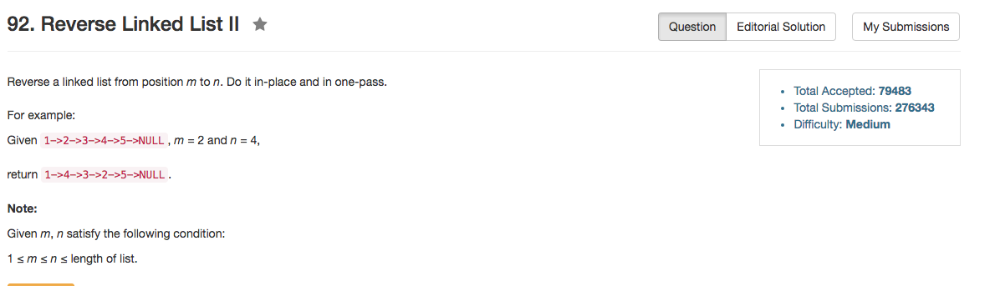

## Algorithm 

- 这道题目其实也比较直接，仿照Reverse Linked List直接做就好了
- 重要的是先找到需要reverse的位置的起点，然后确定要reverse的距离；前者用迭代循环直接找，后者用递归回溯慢慢调整。
- 比较麻烦的边界条件有两个
    1. 计算到底要reverse多少个
    2. 如果`m==1`，那么`head`要更新
- 但是明显有更简洁的迭代算法，比如[这里](https://discuss.leetcode.com/topic/15034/12-lines-4ms-c)这个程序就很好

## Comment

- 好好使用递归

## Code

```C++
class Solution {
public:
    ListNode* reverseBetween(ListNode* head, int m, int n) {
        ListNode* ptr = head;
        if (m == 1) {
            return go(head, n - m);
        } else {
            while (m > 2){
                ptr = ptr->next;
                m--, n--;
            }
            ptr->next = go(ptr->next, n - m);
            return head;
        }
    }
private:
    int count = 0;
    ListNode* go(ListNode* head, int length){
        if (length == 0) {
            return head;
        } else {
            ListNode* newHead = go(head->next, length - 1);
            ListNode* tmp = head->next;
            head->next = head->next->next;
            tmp->next = head;
            return newHead;
        }
    }
};
```

[这里](https://discuss.leetcode.com/topic/15034/12-lines-4ms-c)的迭代算法，而且使用了dummy结点，值得学习。

```C++
class Solution {  
public:
    ListNode* reverseBetween(ListNode* head, int m, int n) {
        ListNode* new_head = new ListNode(0);
        new_head -> next = head;
        ListNode* pre = new_head;
        for (int i = 0; i < m - 1; i++)
            pre = pre -> next;
        ListNode* cur = pre -> next;
        for (int i = 0; i < n - m; i++) {
            ListNode* move = cur -> next; 
            cur -> next = move -> next;
            move -> next = pre -> next;
            pre -> next = move;
        }
        return new_head -> next;
    }
};
```